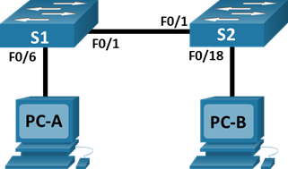

| Устройство  | Интерфейс   | IP-адрес / префикс |
| ------------- |:------------------:| -----:|
| S1     | VLAN 1    | 192.168.1.11 /24 |
| S2     | VLAN 1    | 192.168.1.12 /24 |
| PC-A     | NIC     |   192.168.1.1 /24 |
| PC-B     | NIC     |   192.168.1.2 /24 |


# Часть 1. Создание и настройка сети
## Шаг 1. Подключите сеть в соответствии с топологией.
## Шаг 2. Настройте узлы ПК.
## Шаг 3. Выполните инициализацию и перезагрузку коммутаторов.
## Шаг 4. Настройте базовые параметры каждого коммутатора.
a.	Настройте имена устройств в соответствии с топологией.

b.	Настройте IP-адреса, как указано в таблице адресации.

c.	Назначьте cisco в качестве паролей консоли и VTY.

d.	Назначьте class в качестве пароля доступа к привилегированному режиму EXEC.
```
enable
conf t
hostname S1
enable secret class

int vlan 1
ip address 192.168.1.11 255.255.255.0
no shut
exit
line con 0
password cisco
login
line vty 0 4
password cisco
login
exit
```
# Часть 2. Изучение таблицы МАС-адресов коммутатора
Как только между сетевыми устройствами начинается передача данных, коммутатор выясняет МАС-адреса и строит таблицу.

## Шаг 1. Запишите МАС-адреса сетевых устройств.
a.	Откройте командную строку на PC-A и PC-B и введите команду ipconfig /all.

Назовите физические адреса адаптера Ethernet.

MAC-адрес компьютера PC-A: 0010.110D.A33A

MAC-адрес компьютера PC-B: 0001.647D.E4ED

b.	Подключитесь к коммутаторам S1 и S2 через консоль и введите команду show interface F0/1 на каждом коммутаторе.

Назовите адреса оборудования во второй строке выходных данных команды (или зашитый адрес — bia).

МАС-адрес коммутатора S1 Fast Ethernet 0/1: 0060.4756.6c01

МАС-адрес коммутатора S2 Fast Ethernet 0/1: 00e0.b0d9.2d01

## Шаг 2. Просмотрите таблицу МАС-адресов коммутатора.

Подключитесь к коммутатору S2 через консоль и просмотрите таблицу МАС-адресов до и после тестирования сетевой связи с помощью эхо-запросов.

a.	Подключитесь к коммутатору S2 через консоль и войдите в привилегированный режим EXEC.

b.	В привилегированном режиме EXEC введите команду show mac address-table и нажмите клавишу ввода.

S2# show mac address-table

Записаны ли в таблице МАС-адресов какие-либо МАС-адреса? 

да

Какие МАС-адреса записаны в таблице? С какими портами коммутатора они сопоставлены и каким устройствам принадлежат? Игнорируйте МАС-адреса, сопоставленные с центральным процессором.

Mac-адрес коммутатора S1 Fast Ethernet 0/1

Если вы не записали МАС-адреса сетевых устройств в шаге 1, как можно определить, каким устройствам принадлежат МАС-адреса, используя только выходные данные команды show mac address-table? Работает ли это решение в любой ситуации?

Можно посмотреть какое устройство фмзически воткнуто в порт, указанный в таблице мак адресов 

## Шаг 3. Очистите таблицу МАС-адресов коммутатора S2 и снова отобразите таблицу МАС-адресов.
a.	В привилегированном режиме EXEC введите команду clear mac address-table dynamic и нажмите клавишу Enter.

S2# clear mac address-table dynamic

b.	Снова быстро введите команду show mac address-table.

Указаны ли в таблице МАС-адресов адреса для VLAN 1? Указаны ли другие МАС-адреса?

Адреса для VLAN 1 не указаны. Указан только Mac-адрес коммутатора S1 Fast Ethernet 0/1

Через 10 секунд введите команду show mac address-table и нажмите клавишу ввода. Появились ли в таблице МАС-адресов новые адреса?

Нет

## Шаг 4. С компьютера PC-B отправьте эхо-запросы устройствам в сети и просмотрите таблицу МАС-адресов коммутатора.

a.	На компьютере PC-B откройте командную строку и еще раз введите команду arp -a.

Не считая адресов многоадресной и широковещательной рассылки, сколько пар IP- и МАС-адресов устройств было получено через протокол ARP?

В выводе ничего не указано

b.	Из командной строки PC-B отправьте эхо-запросы на компьютер PC-A, а также коммутаторы S1 и S2.

От всех ли устройств получены ответы? Если нет, проверьте кабели и IP-конфигурации.

От всех получен ответ

c.	Подключившись через консоль к коммутатору S2, введите команду show mac address-table.

Добавил ли коммутатор в таблицу МАС-адресов дополнительные МАС-адреса? Если да, то какие адреса и устройства?

0001.647d.e4ed MAC-адрес компьютера PC-B

0002.16b7.45ba 

0010.110d.a33a MAC-адрес компьютера PC-A

0060.4756.6c01 МАС-адрес коммутатора S1

На компьютере PC-B откройте командную строку и еще раз введите команду arp -a.

Появились ли в ARP-кэше компьютера PC-B дополнительные записи для всех сетевых устройств, которым были отправлены эхо-запросы?

да

## Вопрос для повторения

В сетях Ethernet данные передаются на устройства по соответствующим МАС-адресам. Для этого коммутаторы и компьютеры динамически создают ARP-кэш и таблицы МАС-адресов. Если компьютеров в сети немного, эта процедура выглядит достаточно простой. Какие сложности могут возникнуть в крупных сетях?

Переполнение таблицы мак-адресов
