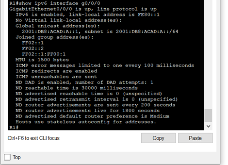

## Топология


## Таблица адресации

| Устройство  | Интерфейс   | IPv6-адрес | Link local IPv6-адрес  | Длина префикса | Шлюз по умолчанию |
| ----------- |:-----------:| -----:|----------- |:-----------:| -----:|
| R1 |	G0/0/0 |	2001:db8:acad:a::1 | fe80::1 | 64| - |	
|  |	G0/0/1 |	2001:db8:acad:1::1 | fe80::1 | 64 | - |
| S1 |	VLAN 1 |	2001:db8:acad:1::b | fe80::b | 64 | - |
PC-A |	NIC	| 2001:db8:acad:1::3 | SLACC | 64 | fe80::1 |
PC-B |	NIC | 2001:db8:acad:a::3 | SLACC | 64 | fe80::1 |

# Часть 1. Настройка топологии и конфигурация основных параметров маршрутизатора и коммутатора
После подключения сети, инициализации и перезагрузки маршрутизатора и коммутатора выполните следующие действия:

## Шаг 1. Настройте маршрутизатор.
Назначьте имя хоста и настройте основные параметры устройства.
```
enable
conf t 
hostname R1
no ip domain lookup
enable secret class
line con 0
password cisco
login
line vty 0 4
password cisco
login
service password-encryption
```

## Шаг 2. Настройте коммутатор.
Назначьте имя хоста и настройте основные параметры устройства.
```
enable
conf t 
hostname S1
no ip domain lookup
enable secret class
line con 0
password cisco
login
line vty 0 4
password cisco
login
service password-encryption
```
# Часть 2. Ручная настройка IPv6-адресов
## Шаг 1. Назначьте IPv6-адреса интерфейсам Ethernet на R1.
a.	Назначьте глобальные индивидуальные IPv6-адреса, указанные в таблице адресации обоим интерфейсам Ethernet на R1.
```
int g0/0/0
ipv6 address 2001:db8:acad:a::1/64
no shut
int g0/0/1
ipv6 address 2001:db8:acad:1::1/64
no shut
```
b.	Введите команду show ipv6 interface brief, чтобы проверить, назначен ли каждому интерфейсу корректный индивидуальный IPv6-адрес.
```
show ipv6 interface brief
GigabitEthernet0/0/0       [up/up]
FE80::201:96FF:FEBC:3501
2001:DB8:ACAD:A::1
GigabitEthernet0/0/1       [up/up]
FE80::201:96FF:FEBC:3502
2001:DB8:ACAD:1::1
Vlan1                      [administratively down/down]
unassigned
```

c.	Чтобы обеспечить соответствие локальных адресов канала индивидуальному адресу, вручную введите локальные адреса канала на каждом интерфейсе Ethernet на R1.

d.	Используйте выбранную команду, чтобы убедиться, что локальный адрес связи изменен на fe80::1.  
```
config t
int g0/0/0
ipv6 address fe80::1 link-local
show ipv6 int g0/0/0
int g0/0/1
ipv6 address fe80::1 link-local
show ipv6 int g0/0/1
```
Закройте окно настройки.

Вопрос:
Какие группы многоадресной рассылки назначены интерфейсу G0/0/0?

FF02::1

FF02::1:FF00:1

## Шаг 2. Активируйте IPv6-маршрутизацию на R1.
a.	В командной строке на PC-B введите команду ipconfig, чтобы получить данные IPv6-адреса, назначенного интерфейсу ПК.

Вопрос:
Назначен ли индивидуальный IPv6-адрес сетевой интерфейсной карте (NIC) на PC-B?

нет

b.	Активируйте IPv6-маршрутизацию на R1 с помощью команды IPv6 unicast-routing.
, чтобы убедиться, что новая многоадресная группа назначена интерфейсу G0/0/0. Обратите внимание, что в списке групп для интерфейса G0/0 отображается группа многоадресной рассылки всех маршрутизаторов (FF02::2).
```
configure terminal
ipv6 unicast-routing
```
c.	Теперь, когда R1 входит в группу многоадресной рассылки всех маршрутизаторов, еще раз введите команду ipconfig на PC-B. Проверьте данные IPv6-адреса.

Вопрос:
Почему PC-B получил глобальный префикс маршрутизации и идентификатор подсети, которые вы настроили на R1?

Все интерфейсы R1 получают RA сообщения

## Шаг 3. Назначьте IPv6-адреса интерфейсу управления (SVI) на S1.
a.	Назначьте адрес IPv6 для S1. Также назначьте этому интерфейсу локальный адрес канала fe80::b.

b.	Проверьте правильность назначения IPv6-адресов интерфейсу управления с помощью команды show ipv6 interface vlan1.
```
int vlan 1
ipv6 address 2001:db8:acad:1::b/64
ipv6 address fe80::b link-local
```
## Шаг 4. Назначьте компьютерам статические IPv6-адреса.
a.	Откройте окно Свойства Ethernet для каждого ПК и назначьте адресацию IPv6.

b.	Убедитесь, что оба компьютера имеют правильную информацию адреса IPv6. Каждый компьютер должен иметь два глобальных адреса IPv6: один статический и один SLACC.

# Часть 3. Проверка сквозного подключения
С PC-A отправьте эхо-запрос на FE80::1. Это локальный адрес канала, назначенный G0/1 на R1.

Отправьте эхо-запрос на интерфейс управления S1 с PC-A.

Введите команду tracert на PC-A, чтобы проверить наличие сквозного подключения к PC-B.

С PC-B отправьте эхо-запрос на PC-A.

С PC-B отправьте эхо-запрос на локальный адрес канала G0/0 на R1.

Вопросы для повторения
1.	Почему обоим интерфейсам Ethernet на R1 можно назначить один и тот же локальный адрес канала — FE80::1?

они используются только в локальной сети

2.	Какой идентификатор подсети в индивидуальном IPv6-адресе 2001:db8:acad::aaaa:1234/64?

2001:db8:acad::/64
Это 4 хекстет
