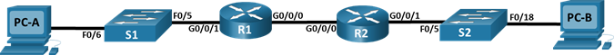

## Топология



## Таблица адресации

| Устройство  | Интерфейс   | IPv6-адрес | 
| ----------- |:-----------:| -----:|
| R1 |	G0/0/0 |	2001:db8:acad:2::1/64 |	
|  |	 |	fe80::1 |	
|  |	G0/0/1 |	2001:db8:acad:1::1/64 |	
|  |	 |	fe80::2 |
| R2 |	G0/0/0 |	2001:db8:acad:2::2/64 |	
|  |	 |	fe80::2 |	
|  |	G0/0/1 |	2001:db8:acad:3::1/64 |	
|  |	 |	fe80::1 |	
PC-A |	NIC	| DHCP |		
PC-B |	NIC |	DHCP |	

# Часть 1. Создание сети и настройка основных параметров устройства

## Шаг 1. Создайте сеть согласно топологии.
Подключите устройства, как показано в топологии, и подсоедините необходимые кабели.
## Шаг 2. Настройте базовые параметры каждого коммутатора. 

a.	Присвойте коммутатору имя устройства.

b.	Отключите поиск DNS, чтобы предотвратить попытки маршрутизатора неверно преобразовывать введенные команды таким образом, как будто они являются именами узлов.

c.	Назначьте class в качестве зашифрованного пароля привилегированного режима EXEC.

d.	Назначьте cisco в качестве пароля консоли и включите вход в систему по паролю.

e.	Назначьте cisco в качестве пароля VTY и включите вход в систему по паролю.

f.	Зашифруйте открытые пароли.

g.	Создайте баннер с предупреждением о запрете несанкционированного доступа к устройству.

h.	Отключите все неиспользуемые порты.

i.	Сохраните текущую конфигурацию в файл загрузочной конфигурации.
```
enable
conf t
hostname R1
no ip domain lookup
enable secret class
line con 0
password cisco
login
line vty 0 4
password cisco
login
service password-encryption
banner motd # Unauthorized access is strictly prohibited. #
int range f0/1-4, f0/7-24, g0/1-2
shut
copy running-config startup-config
```

## Шаг 3. Произведите базовую настройку маршрутизаторов.

a.	Назначьте маршрутизатору имя устройства.

b.	Отключите поиск DNS, чтобы предотвратить попытки маршрутизатора неверно преобразовывать введенные команды таким образом, как будто они являются именами узлов.

c.	Назначьте class в качестве зашифрованного пароля привилегированного режима EXEC.

d.	Назначьте cisco в качестве пароля консоли и включите вход в систему по паролю.

e.	Назначьте cisco в качестве пароля VTY и включите вход в систему по паролю.
f.	Зашифруйте открытые пароли.

g.	Создайте баннер с предупреждением о запрете несанкционированного доступа к устройству.

h.	Активация IPv6-маршрутизации

i.	Сохраните текущую конфигурацию в файл загрузочной конфигурации.
```
enable
conf t
hostname R1
no ip domain lookup
enable secret class
line con 0
password cisco
login
line vty 0 4
password cisco
login
service password-encryption
banner motd # Unauthorized access is strictly prohibited. #
ipv6 unicast-routing
copy running-config startup-config
```
## Шаг 4. Настройка интерфейсов и маршрутизации для обоих маршрутизаторов.
a.	Настройте интерфейсы G0/0/0 и G0/1 на R1 и R2 с адресами IPv6, указанными в таблице выше. 

b.	Настройте маршрут по умолчанию на каждом маршрутизаторе, который указывает на IP-адрес G0/0/0 на другом маршрутизаторе.

c.	Убедитесь, что маршрутизация работает с помощью пинга адреса G0/0/1 R2 из R1

d.	Сохраните текущую конфигурацию в файл загрузочной конфигурации.
```
int g0/0/1
ipv6 address fe80::1 link-local
ipv6 address 2001:db8:acad:1::1/64
no shut
int g0/0/0
ipv6 address fe80::1 link-local
ipv6 address 2001:db8:acad:2::1/64
no shut
ipv6 route ::/0 2001:db8:acad:2::2
copy running-config startup-config

int g0/0/1
ipv6 address fe80::1 link-local
ipv6 address 2001:db8:acad:3::1/64
no shut
int g0/0/0
ipv6 address fe80::2 link-local
ipv6 address 2001:db8:acad:2::2/64
no shut
ipv6 route ::/0 2001:db8:acad:2::1
copy running-config startup-config
```

# Часть 2. Проверка назначения адреса SLAAC от R1
В части 2 вы убедитесь, что узел PC-A получает адрес IPv6 с помощью метода SLAAC.
Включите PC-A и убедитесь, что сетевой адаптер настроен для автоматической настройки IPv6.
Через несколько минут результаты команды ipconfig должны показать, что PC-A присвоил себе адрес из сети 2001:db8:1::/64.

C:\Users\Student> ipconfig 

Настройка IP для Windows

Ethernet adapter Ethernet 2: 
```

   Connection-specific DNS Suffix . : 
   IPv6 Address. . . . . . . . . . . : 2001:db8:acad: 1:5 c43:ee7c:2959:da68
   Temporary IPv6 Address. . . . . . : 2001:db8:acad: 1:3 c64:e4f 9:46 e 1:1 f23
   Link-local IPv6-адрес. . . . .: fe80። 5c43:ee7c:2959:да 68% 6
   IPv4-адрес. . . . . . . . . . . : 169.254.218.104
   Subnet Mask . . . . . . . . . . . : 255.255.0.0
   Default Gateway . . . . . . . . .: fe80።1%6
   ```
Вопрос:

Откуда взялась часть адреса с идентификатором хоста?

Адрес сгенерировался самостоятельно случайным образом

# Часть 3. Настройка и проверка сервера DHCPv6 на R1
В части 3 выполняется настройка и проверка состояния DHCP-сервера на R1. Цель состоит в том, чтобы предоставить PC-A информацию о DNS-сервере и домене.
## Шаг 1. Более подробно изучите конфигурацию PC-A.
a.	Выполните команду ipconfig /all на PC-A и посмотрите на результат.

C:\Users\Student> ipconfig /all
```
Windows IP Configuration

   Host Name . . . . . . . . . . . . : НАСТОЛЬНАЯ 3FR7RKA
   Primary Dns Suffix . . . . . . . : 
   Node Type . . . . . . . . . . . . : Hybrid
   IP Routing Enabled. . . . . . . . : No
   WINS Proxy Enabled. . . . . . . . : No
Ethernet adapter Ethernet0:

   Connection-specific DNS Suffix . : 
   Description . . . . . . . . . . . : Intel(R) 852574L Gigabit Network Connection 
   Physical Address. . . . . . . . . : 00-50-56-83-63-6D
   IPv6 Address. . . . . . . . . . . : 2001:db8:acad:1:5c43:ee7c:2959:da68(Preferred)
   Temporary IPv6 Address. . . . . . : 2001:db8:acad:1:3c64:e4f9:46e1:1f23(Preferred)
   Link-local IPv6-адрес. . . . . : fe80::5c43:ee7c:2959:da68%6(Preferred)
   IPv4 Address. . . . . . . . . . . : 169.254.218.104(Preferred)
   Subnet Mask . . . . . . . . . . . : 255.255.0.0
   Шлюз по умолчанию . . . . . . . . .: fe80።1%6
   DHCPv6 IAID . . . . . . . . . . . : 50334761
   DHCPv6 Client DUID.  . . . . . . . : 00-01-00-01-24-F5-CE-A2-00-50-56-B3-63-6D
   DNS-серверы . . . . . . . . . . . : fec0:0:0:ffff::1%1
                                       fec0:0:0:ffff::2%1
                                       fec0:0:0:ffff::3%1
   NetBIOS over Tcpip. . . . . . . . : Enabled
   ```
b.	Обратите внимание, что основной DNS-суффикс отсутствует. Также обратите внимание, что предоставленные адреса DNS-сервера являются адресами «локального сайта anycast», а не одноадресные адреса, как ожидалось.
## Шаг 2. Настройте R1 для предоставления DHCPv6 без состояния для PC-A.

a.	Создайте пул DHCP IPv6 на R1 с именем R1-STATELESS. В составе этого пула назначьте адрес DNS-сервера как 2001:db8:acad: :1, а имя домена — как stateless.com.

Откройте окно конфигурации
```
R1(config)# ipv6 dhcp pool R1-STATELESS
R1(config-dhcp)# dns-server 2001:db8:acad::254
R1(config-dhcp)# domain-name STATELESS.com
```
b.	Настройте интерфейс G0/0/1 на R1, чтобы предоставить флаг конфигурации OTHER для локальной сети R1 и укажите только что созданный пул DHCP в качестве ресурса DHCP для этого интерфейса.
```
R1(config)# interface g0/0/1
R1(config-if)# ipv6 nd other-config-flag 
R1(config-if)# ipv6 dhcp server R1-STATELESS
```
c.	Сохраните текущую конфигурацию в файл загрузочной конфигурации.

d.	Перезапустите PC-A.

e.	Проверьте вывод ipconfig /all и обратите внимание на изменения.

C:\Users\Student> ipconfig /all
```
Windows IP Configuration 

   Host Name . . . . . . . . . . . . : DESKTOP-3FR7RKA
   Primary Dns Suffix . . . . . . . : 
   Node Type . . . . . . . . . . . . : Hybrid
   IP Routing Enabled. . . . . . . . : No
   WINS Proxy Enabled. . . . . . . . : No
   DNS Suffix Search List. . . . . . : STATELESS.com

Ethernet adapter Ethernet0:

   Connection-specific DNS Suffix . : STATELESS.com
   Описание . . . . . . . . . . . : Intel(R) 82574L Gigabit Network Connection
   Physical Address. . . . . . . . . : 00-50-56-83-63-6D
   DHCP Enabled. . . . . . . . . . . : Yes
   Autoconfiguration Enabled . . . . : Yes
   IPv6 Address. . . . . . . . . . . : 2001:db8:acad:1:5c43:ee7c:2959:da68(Preferred)
   Temporary IPv6 Address. . . . . . : 2001:db8:acad:1:3c64:e4f9:46e1:1f23(Preferred)
   Link-local IPv6-адрес. . . . . : fe80::5c43:ee7c:2959:da68%6(Preferred)
   IPv4 Address. . . . . . . . . . . : 169.254.218.104(Preferred)
   Subnet Mask . . . . . . . . . . . : 255.255.0.0
   Default Gateway . . . . . . . . .: fe80።1%6
   DHCPv6 IAID . . . . . . . . . . . : 50334761
   DHCPv6 Client DUID. . . . . . . . : 00-01-00-01-24-F5-CE-A2-00-50-56-B3-63-6D
   DNS Servers . . . . . . . . . . . : 2001:db8:acad። 254
   NetBIOS over Tcpip. . . . . . . . : Enabled
   Список поиска DNS-суффиксов подключения: 
                                       STATELESS.com
```

f.	Тестирование подключения с помощью пинга IP-адреса интерфейса G0/1 R2.

# Часть 4. Настройка сервера DHCPv6 с сохранением состояния на R1
В части 4 настраивается R1 для ответа на запросы DHCPv6 от локальной сети на R2.

a.	Создайте пул DHCPv6 на R1 для сети 2001:db8:acad:3:aaa::/80. Это предоставит адреса локальной сети, подключенной к интерфейсу G0/0/1 на R2. В составе пула задайте DNS-сервер 2001:db8:acad: :254 и задайте доменное имя STATEFUL.com.
```
R1(config)# ipv6 dhcp pool R2-STATEFUL
R1(config-dhcp)# address prefix 2001:db8:acad:3:aaa::/80
R1(config-dhcp)# dns-server 2001:db8:acad::254
R1(config-dhcp)# domain-name STATEFUL.com
```
b.	Назначьте только что созданный пул DHCPv6 интерфейсу g0/0/0 на R1.
```
R1(config)# interface g0/0/0
R1(config-if)# ipv6 dhcp server R2-STATEFUL
```
# Часть 5. Настройка и проверка ретрансляции DHCPv6 на R2.
В части 5 необходимо настроить и проверить ретрансляцию DHCPv6 на R2, позволяя PC-B получать адрес IPv6.

## Шаг 1. Включите PC-B и проверьте адрес SLAAC, который он генерирует.
C:\Users\Student> ipconfig /all
```
Windows IP Configuration

   Host Name . . . . . . . . . . . . : DESKTOP-3FR7RKA
   Primary Dns Suffix . . . . . . . : 
   Node Type . . . . . . . . . . . . : Hybrid
   IP Routing Enabled. . . . . . . . : No
   WINS Proxy Enabled. . . . . . . . : No

Ethernet adapter Ethernet0:

   Connection-specific DNS Suffix . : 
   Description . . . . . . . . . . . : Intel(R) 82574L Gigabit Network Connection
   Physical Address. . . . . . . . . : 00-50-56-B3-7B-06
   DHCP Enabled. . . . . . . . . . . : Yes
   Autoconfiguration Enabled . . . . : Yes
   IPv6 Address. . . . . . . . . . . : 2001:db8:acad:3:a0f3:3d39:f9fb:a020(Preferred) 
   Temporary IPv6 Address. . . . . . : 2001:db8:acad:3:d4f3:7b16:eeee:b2b5(Preferred) 
   Link-local IPv6 address. . . . . : fe80::a0f3:3d39:f9fb:a020%6(Preferred) 
   IPv4 Address. . . . . . . . . . . : 169.254.160.32(Preferred) 
   Subnet Mask . . . . . . . . . . . : 255.255.0.0
   Default Gateway . . . . . . . . .: fe80።1%6
   DHCPv6 IAID . . . . . . . . . . . : 50334761
   DHCPv6 Client DUID. . . . . . . . : 00-01-00-01-24-F2-08-38-00-50-56-B3-7B-06
   DNS Servers . . . . . . . . . . . : fec0:0:0:ffff::1%1
                                       fec0:0:0:ffff::2%1
                                       fec0:0:0:ffff::3%1
   NetBIOS over Tcpip. . . . . . . . : Enabled
```
Обратите внимание на вывод, что используется префикс 2001:db8:acad:3::
## Шаг 2. Настройте R2 в качестве агента DHCP-ретрансляции для локальной сети на G0/0/1.
a.	Настройте команду ipv6 dhcp relay на интерфейсе R2 G0/0/1, указав адрес назначения интерфейса G0/0/0 на R1. Также настройте команду managed-config-flag .
```
R2 (конфигурация) # интерфейс g0/0/1
R2(config-if)# ipv6 nd managed-config-flag
R2(config-if)# ipv6 dhcp relay destination 2001:db8:acad:2::1 g0/0/0
```
b.	Сохраните конфигурацию.

## Шаг 3. Попытка получить адрес IPv6 из DHCPv6 на PC-B.
a.	Перезапустите PC-B.

b.	Откройте командную строку на PC-B и выполните команду ipconfig /all и проверьте выходные данные, чтобы увидеть результаты операции ретрансляции DHCPv6.

C:\Users\Student> ipconfig /all
```
Windows IP Configuration

   Host Name . . . . . . . . . . . . : DESKTOP-3FR7RKA
   Primary Dns Suffix . . . . . . . : 
   Node Type . . . . . . . . . . . . : Hybrid
   IP Routing Enabled. . . . . . . . : No
   WINS Proxy Enabled. . . . . . . . : No
   DNS Suffix Search List. . . . . . : STATEFUL.com

Ethernet adapter Ethernet0:

   Connection-specific DNS Suffix . : STATEFUL.com
   Description . . . . . . . . . . . : Intel(R) 852574L Gigabit Network Connection
   Physical Address. . . . . . . . . : 00-50-56-B3-7B-06
   DHCP Enabled. . . . . . . . . . . : Yes
   Autoconfiguration Enabled . . . . : Yes
   IPv6 Address. . . . . . . . . . . : 2001:db8:acad3:aaaa:7104:8b7d:5402(Preferred)
   Lease Obtained. . . . . . . . . . : Sunday, October 6, 2019 3:27:13 PM
   Lease Expires . . . . . . . . . . Tuesday, October 8, 2019 3:27:13 PM
   Link-local IPv6-адрес. . . . . : fe80::a0f3:3d39:f9fb:a020%6(Preferred)
   IPv4 Address. . . . . . . . . . . : 169.254.160.32(Preferred)
   Subnet Mask . . . . . . . . . . . : 255.255.0.0
   Default Gateway . . . . . . . . .: fe80። 2% 6
   DHCPv6 IAID . . . . . . . . . . . : 50334761
   DHCPv6 Client DUID. . . . . . . . : 00-01-00-01-24-F2-08-38-00-50-56-B3-7B-06
   DNS Servers . . . . . . . . . . . : 2001:db8:acad። 254
   NetBIOS over Tcpip. . . . . . . . : Включен
   Список поиска DNS-суффиксов подключения:
                                       STATEFUL.com
```
c.	Проверьте подключение с помощью пинга IP-адреса интерфейса R0 G0/0/1.
