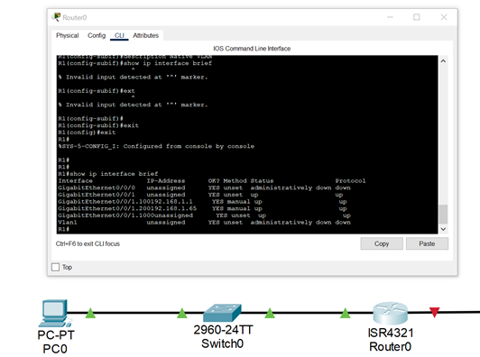
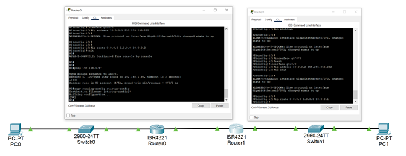
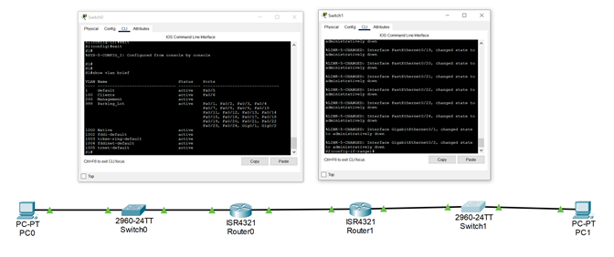
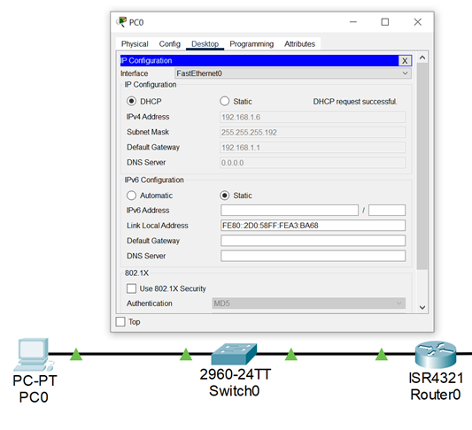
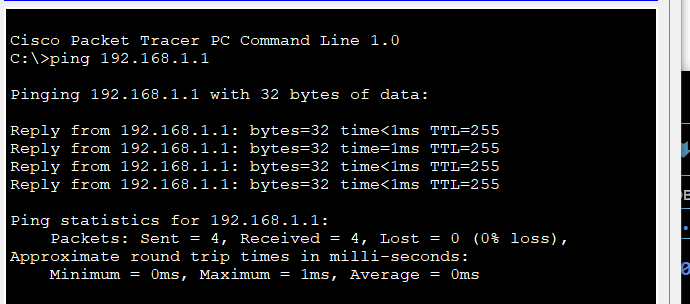
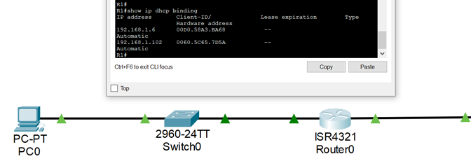

## Топология


## Таблица адресации

| Устройство  | Интерфейс   | IPv6-адрес | Маска подсети | Шлюз по умолчанию |
| ----------- |:-----------:| -----:|:-----------:| -----:|
| R1 |	G0/0/0 |	10.0.0.1 |	255.255.255.252 | - |
|  | G0/0/1 |	- |	- | -|
|  | G0/0/1.100 |	192.168.1.1 |	255.255.255.192 | -|
|  | G0/0/1.200	 |	192.168.1.65 | 255.255.255.224 | -|
|  | G0/0/1.1000 |	- | - | - |
| R2 |	G0/0 |	10.0.0.2 |	255.255.255.252 | - |
|  | G0/0/1	|	192.168.1.97 |	255.255.255.240 | - |
|  S1 |	VLAN 200 |	192.168.1.66 |	255.255.255.224 | 192.168.1.65 |
|  S2 |	VLAN 1 |	192.168.1.98 |	255.255.255.240 | 192.168.1.97 |
PC-A |	NIC	| DHCP | DHCP |	DHCP |	
PC-B |	NIC |	DHCP |	DHCP | DHCP |

## Таблица VLAN

| VLAN  | Имя   | Назначенный интерфейс|
| ----------- |:-----------:| -----:|
| 1 | Нет | S2: F0/18 |
| 100 | Клиенты | S1: F0/6 |
| 200 | Управление | S1: VLAN 200  |
| 999 | Parking_Lot | S1: F0/1-4, F0/7-24, G0/1-2 |
| 1000 | Собственная | - |

# Часть 1.	Создание сети и настройка основных параметров устройства

## Шаг 1.	Создание схемы адресации

Подсеть A - 192.168.1.0/26

Подсеть B: 192.168.1.64/27

Подсеть C: 192.168.1.96/28

## Шаг 2.	Создайте сеть согласно топологии.
Подключите устройства, как показано в топологии, и подсоедините необходимые кабели.

## Шаг 3.	Произведите базовую настройку маршрутизаторов.
a.	Назначьте маршрутизатору имя устройства.

b.	Отключите поиск DNS, чтобы предотвратить попытки маршрутизатора неверно преобразовывать введенные команды таким образом, как будто они являются именами узлов.

c.	Назначьте class в качестве зашифрованного пароля привилегированного режима EXEC.

d.	Назначьте cisco в качестве пароля консоли и включите вход в систему по паролю.

e.	Назначьте cisco в качестве пароля VTY и включите вход в систему по паролю.

f.	Зашифруйте открытые пароли.

g.	Создайте баннер с предупреждением о запрете несанкционированного доступа к устройству.

h.	Сохраните текущую конфигурацию в файл загрузочной конфигурации.

i.	Установите часы на маршрутизаторе на сегодняшнее время и дату.
```
Enable
conf t
hostname R1
no ip domain lookup
enable secret class
line con 0
password cisco
login
line vty 0 4
password cisco
login
service password-encryption
banner motd # Unauthorized access is strictly prohibited. #
clock set 16:00 21 dec 2024
copy running-config startup-config
exit
```
## Шаг 4.	Настройка маршрутизации между сетями VLAN на маршрутизаторе R1
a.	Активируйте интерфейс G0/0/1 на маршрутизаторе.

b.	Настройте подинтерфейсы для каждой VLAN в соответствии с требованиями таблицы IP-адресации. Все субинтерфейсы используют инкапсуляцию 802.1Q и назначаются первый полезный адрес из вычисленного пула IP-адресов. Убедитесь, что подинтерфейсу для native VLAN не назначен IP-адрес. Включите описание для каждого подинтерфейса.
```
int g0/0/1.100
no shut
exit
int g0/0/1.100
description client net
en d 100
ip address 192.168.1.1 255.255.255.192
int g0/0/1.200
en d 200
description management net
ip address 192.168.1.65 255.255.255.224
int g0/0/1.1000
en d 1000 native
description native vlan
 ```


## Шаг 5.	Настройте G0/1 на R2, затем G0/0/0 и статическую маршрутизацию для обоих маршрутизаторов
a.	Настройте G0/0/1 на R2 с первым IP-адресом подсети C, рассчитанным ранее.
 ```
int g0/0/1
ip address 192.168.1.97 255.255.255.240
no shut
 ```
b.	Настройте интерфейс G0/0/0 для каждого маршрутизатора на основе приведенной выше таблицы IP-адресации.
 ```
int g0/0/0
ip address 10.0.0.1 255.255.255.252
no shut
exit
ip route 0.0.0.0 0.0.0.0 10.0.0.2
copy running-config startup-config
 ```
c.	Настройте маршрут по умолчанию на каждом маршрутизаторе, указываемом на IP-адрес G0/0/0 на другом маршрутизаторе.
 ```
int g0/0/0
ip address 10.0.0.2 255.255.255.252
no shut
exit
ip route 0.0.0.0 0.0.0.0 10.0.0.1
copy running-config startup-config
 ```
d.	Убедитесь, что статическая маршрутизация работает с помощью пинга до адреса G0/0/1 R2 от R1.

e.	Сохраните текущую конфигурацию в файл загрузочной конфигурации.
 
## Шаг 6.	Настройте базовые параметры каждого коммутатора.
a.	Присвойте коммутатору имя устройства.

b.	Отключите поиск DNS, чтобы предотвратить попытки маршрутизатора неверно преобразовывать введенные команды таким образом, как будто они являются именами узлов.

c.	Назначьте class в качестве зашифрованного пароля привилегированного режима EXEC.

d.	Назначьте cisco в качестве пароля консоли и включите вход в систему по паролю.

e.	Назначьте cisco в качестве пароля VTY и включите вход в систему по паролю.

f.	Зашифруйте открытые пароли.

g.	Создайте баннер с предупреждением о запрете несанкционированного доступа к устройству.

h.	Сохраните текущую конфигурацию в файл загрузочной конфигурации.

i.	Установите часы на маршрутизаторе на сегодняшнее время и дату.

j.	Скопируйте текущую конфигурацию в файл загрузочной конфигурации.
 ```
Enable
conf t
hostname S1
no ip domain lookup
enable secret class
line con 0
password cisco
login
line vty 0 4
password cisco
login
service password-encryption
banner motd # Unauthorized access is strictly prohibited. #
clock set 16:00 21 dec 2024
copy running-config startup-config
exit
 ```

## Шаг 7.	Создайте сети VLAN на коммутаторе S1.
Примечание. S2 настроен только с базовыми настройками. 
a.	Создайте необходимые VLAN на коммутаторе 1 и присвойте им имена из приведенной выше таблицы.
 ```
conf t
vlan 100
name Clients
vlan 200
name Management
vlan 999
name Parking_Lot
vlan 1000
name Native
 ```
b.	Настройте и активируйте интерфейс управления на S1 (VLAN 200), используя второй IP-адрес из подсети, рассчитанный ранее. Кроме того установите шлюз по умолчанию на S1.
 ```
int vlan 200
ip address 192.168.1.66 255.255.255.224
no shut
exit
ip default-gateway 192.168.1.65
int range f0/1 - 4, f0/7 - 24, g0/1 - 2
sw m access
sw m access vlan 999
shut
 ```
c.	Настройте и активируйте интерфейс управления на S2 (VLAN 1), используя второй IP-адрес из подсети, рассчитанный ранее. Кроме того, установите шлюз по умолчанию на S2
 ```
Conf t
int vlan 1
ip address 192.168.1.98 255.255.255.240
no shut
exit
ip default-gateway 192.168.1.97
int range f0/1 - 4, f0/6 - 17, f0/19 - 24, g0/1 - 2
sw m access
shut
 ```

d.	Назначьте все неиспользуемые порты S1 VLAN Parking_Lot, настройте их для статического режима доступа и административно деактивируйте их. На S2 административно деактивируйте все неиспользуемые порты.


Шаг 8.	Назначьте сети VLAN соответствующим интерфейсам коммутатора.
a.	Назначьте используемые порты соответствующей VLAN (указанной в таблице VLAN выше) и настройте их для режима статического доступа.
 ```
int f0/6
sw m access
sw m access vlan 100
 ```

b.	Убедитесь, что VLAN назначены на правильные интерфейсы.

 
Вопрос:
Почему интерфейс F0/5 указан в VLAN 1?

Он дефолтный

## Шаг 9.	Вручную настройте интерфейс S1 F0/5 в качестве транка 802.1Q.

a.	Измените режим порта коммутатора, чтобы принудительно создать магистральный канал.

b.	В рамках конфигурации транка  установите для native  VLAN значение 1000.

c.	В качестве другой части конфигурации магистрали укажите, что VLAN 100, 200 и 1000 могут проходить по транку.

d.	Сохраните текущую конфигурацию в файл загрузочной конфигурации.

e.	Проверьте состояние транка.

 ```
Conf t
interface f0/6
sw m trunk
sw trunk native vlan 1000
sw trunk allowed vlan 100,200,1000
copy running-config startup-config
 ```
Какой IP-адрес был бы у ПК, если бы он был подключен к сети с помощью DHCP?

 Использовалась бы служба АПИПА, айпишник начинается на 169

# Часть 2.	Настройка и проверка двух серверов DHCPv4 на R1

В части 2 необходимо настроить и проверить сервер DHCPv4 на R1. Сервер DHCPv4 будет обслуживать две подсети, подсеть A и подсеть C.

## Шаг 1.	Настройте R1 с пулами DHCPv4 для двух поддерживаемых подсетей. Ниже приведен только пул DHCP для подсети A

a.	Исключите первые пять используемых адресов из каждого пула адресов.

b.	Создайте пул DHCP (используйте уникальное имя для каждого пула).

c.	Укажите сеть, поддерживающую этот DHCP-сервер.

d.	В качестве имени домена укажите CCNA-lab.com.

e.	Настройте соответствующий шлюз по умолчанию для каждого пула DHCP.

f.	Настройте время аренды на 2 дня 12 часов и 30 минут.

g.	Затем настройте второй пул DHCPv4, используя имя пула R2_Client_LAN и вычислите сеть, маршрутизатор по умолчанию, и используйте то же имя домена и время аренды, что и предыдущий пул DHCP.
 ```
conf t
ip dhcp excluded-address 192.168.1.1 192.168.1.5
ip dhcp pool Client_Pool1
domain-name ccna-lab.com
default-router 192.168.1.1
ip dhcp excluded-address 192.168.1.97 192.168.1.101
ip dhcp pool R2_Client_LAN
network 192.168.1.96 255.255.255.240
default-router 192.168.1.97
domain-name ccna-lab.com
copy running-config startup-config
 ```
## Шаг 2.	Сохраните конфигурацию.
Сохраните текущую конфигурацию в файл загрузочной конфигурации.


## Шаг 3.	Проверка конфигурации сервера DHCPv4
a.	Чтобы просмотреть сведения о пуле, выполните команду show ip dhcp pool .

b.	Выполните команду show ip dhcp bindings для проверки установленных назначений адресов DHCP.

c.	Выполните команду show ip dhcp server statistics для проверки сообщений DHCP.

## Шаг 4.	Попытка получить IP-адрес от DHCP на PC-A
a.	Из командной строки компьютера PC-A выполните команду ipconfig /all.

b.	После завершения процесса обновления выполните команду ipconfig для просмотра новой информации об IP-адресе.

c.	Проверьте подключение с помощью пинга IP-адреса интерфейса R0 G0/0/1.
 

 
## Часть 3.	Настройка и проверка DHCP-ретрансляции на R2
В части 3 настраивается R2 для ретрансляции DHCP-запросов из локальной сети на интерфейсе G0/0/1 на DHCP-сервер (R1). 

## Шаг 1.	Настройка R2 в качестве агента DHCP-ретрансляции для локальной сети на G0/0/1

a.	Настройте команду ip helper-address на G0/0/1, указав IP-адрес G0/0/0 R1.
 ```
int g0/0/1
ip helper-address 10.0.0.1
 ```
b.	Сохраните конфигурацию.

## Шаг 2.	Попытка получить IP-адрес от DHCP на PC-B
a.	Из командной строки компьютера PC-B выполните команду ipconfig /all.

b.	После завершения процесса обновления выполните команду ipconfig для просмотра новой информации об IP-адресе.

c.	Проверьте подключение с помощью пинга IP-адреса интерфейса R1 G0/0/1.

d.	Выполните show ip dhcp binding для R1 для проверки назначений адресов в DHCP.
 
f.	Выполните команду show ip dhcp server statistics для проверки сообщений DHCP.


