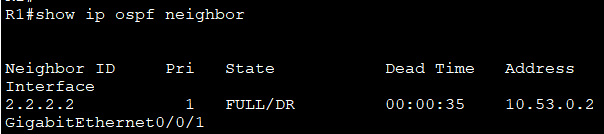

Лабораторная работа. Настройка протокола OSPFv2 для одной области

## Топология
 
## Таблица адресации
| Устройство  | Интерфейс   | IP-адрес | Маска подсети |
| ----------- |:-----------:| -----:|:-----------:| 
|  R1 |	G0/0/1 | 10.53.0.1 | 255.255.255.0 | 
|   |	Loopback1 | 172.16.1.1 | 255.255.255.0 |
| R2 |	G0/0/1 | 10.53.0.2 | 255.255.255.0 |	
|  |	Loopback1 | 192.168.1.1 | 255.255.255.0 |	

# Часть 1. Создание сети и настройка основных параметров устройства
## Шаг 1. Создайте сеть согласно топологии.
Подключите устройства, как показано в топологии, и подсоедините необходимые кабели.
## Шаг 2. Произведите базовую настройку маршрутизаторов.
a.	Назначьте маршрутизатору имя устройства.

b.	Отключите поиск DNS, чтобы предотвратить попытки маршрутизатора неверно преобразовывать введенные команды таким образом, как будто они являются именами узлов.

c.	Назначьте class в качестве зашифрованного пароля привилегированного режима EXEC.

d.	Назначьте cisco в качестве пароля консоли и включите вход в систему по паролю.

e.	Назначьте cisco в качестве пароля VTY и включите вход в систему по паролю.

f.	Зашифруйте открытые пароли.

g.	Создайте баннер с предупреждением о запрете несанкционированного доступа к устройству.

h.	Сохраните текущую конфигурацию в файл загрузочной конфигурации.
```
Enable
conf t
hostname R1
no ip domain lookup
enable secret class
line con 0
password cisco
login
line vty 0 4
password cisco
login
service password-encryption
banner motd # Unauthorized access is strictly prohibited. #
exit
copy running-config startup-config
```
## Шаг 3. Настройте базовые параметры каждого коммутатора.
a.	Назначьте коммутатору имя устройства.

b.	Отключите поиск DNS, чтобы предотвратить попытки маршрутизатора неверно преобразовывать введенные команды таким образом, как будто они являются именами узлов.

c.	Назначьте class в качестве зашифрованного пароля привилегированного режима EXEC.

d.	Назначьте cisco в качестве пароля консоли и включите вход в систему по паролю.

e.	Назначьте cisco в качестве пароля VTY и включите вход в систему по паролю.

f.	Зашифруйте открытые пароли.

g.	Создайте баннер с предупреждением о запрете несанкционированного доступа к устройству.

h.	Сохраните текущую конфигурацию в файл загрузочной конфигурации.
```
Enable
conf t
hostname S1
no ip domain lookup
enable secret class
line con 0
password cisco
login
line vty 0 4
password cisco
login
service password-encryption
banner motd # Unauthorized access is strictly prohibited. #
exit
copy running-config startup-config
```

# Часть 2. Настройка и проверка базовой работы протокола OSPFv2 для одной области
## Шаг 1. Настройте адреса интерфейса и базового OSPFv2 на каждом маршрутизаторе.

a.	Настройте адреса интерфейсов на каждом маршрутизаторе, как показано в таблице адресации выше.

b.	Перейдите в режим конфигурации маршрутизатора OSPF, используя идентификатор процесса 56.

c.	Настройте статический идентификатор маршрутизатора для каждого маршрутизатора (1.1.1.1 для R1, 2.2.2.2 для R2).

d.	Настройте инструкцию сети для сети между R1 и R2, поместив ее в область 0.

e.	Только на R2 добавьте конфигурацию, необходимую для объявления сети Loopback 1 в область OSPF 0.

f.	Убедитесь, что OSPFv2 работает между маршрутизаторами. Выполните команду, чтобы убедиться, что R1 и R2 сформировали смежность.

R1
```
int g0/0/1
ip address 10.53.0.1 255.255.255.0
no shut
exit
int loopback 1
ip address 172.16.1.1 255.255.255.0
router ospf 56
router-id 1.1.1.1
network 10.53.0.0 0.0.0.255 area 0
```
R2
```
int g0/0/1
ip address 10.53.0.2 255.255.255.0
no shut
exit
int loopback 1
ip address 192.168.1.1 255.255.255.0
router ospf 56
router-id 2.2.2.2
network 10.53.0.0 0.0.0.255 area 0
network 192.168.1.0 0.0.0.255 area 0
exit
int loopback 1
ip ospf 56 area 0
```
Вопрос:
Какой маршрутизатор является DR? Какой маршрутизатор является BDR? Каковы критерии отбора?

dr – тот у кого выше роутер айди

 

 
g.	На R1 выполните команду show ip route ospf, чтобы убедиться, что сеть R2 Loopback1 присутствует в таблице маршрутизации. Обратите внимание, что поведение OSPF по умолчанию заключается в объявлении интерфейса обратной связи в качестве маршрута узла с использованием 32-битной маски.

 

h.	Запустите Ping до адреса интерфейса R2 Loopback 1 из R1. Выполнение команды ping должно быть успешным.


# Часть 3. Оптимизация и проверка конфигурации OSPFv2 для одной области
## Шаг 1. Реализация различных оптимизаций на каждом маршрутизаторе.

a.	На R1 настройте приоритет OSPF интерфейса G0/0/1 на 50, чтобы убедиться, что R1 является назначенным маршрутизатором.

b.	Настройте таймеры OSPF на G0/0/1 каждого маршрутизатора для таймера приветствия, составляющего 30 секунд.

c.	На R1 настройте статический маршрут по умолчанию, который использует интерфейс Loopback 1 в качестве интерфейса выхода. Затем распространите маршрут по умолчанию в OSPF. Обратите внимание на сообщение консоли после установки маршрута по умолчанию.

d.	добавьте конфигурацию, необходимую для OSPF для обработки R2 Loopback 1 как сети точка-точка. Это приводит к тому, что OSPF объявляет Loopback 1 использует маску подсети интерфейса.

e.	Только на R2 добавьте конфигурацию, необходимую для предотвращения отправки объявлений OSPF в сеть Loopback 1.

f.	Измените базовую пропускную способность для маршрутизаторов. После этой настройки перезапустите OSPF с помощью команды clear ip ospf process . Обратите внимание на сообщение консоли после установки новой опорной полосы пропускания.

R1
```
conf t
int g0/0/1
ip ospf priority 50
ip ospf hello-interval 30
ip ospf dead-interval 120
exit
ip route 0.0.0.0 0.0.0.0 loopback 1
router ospf 56
default-information originate
auto-cost reference-bandwidth 1000
end
clear ip ospf process
```
R2
```
conf t
int g0/0/1
ip ospf hello-interval 30
ip ospf dead-interval 120
int loopback 1
ip ospf network point-to-point
exit
router ospf 56
passive-interface loopback 1
auto-cost reference-bandwidth 1000
end
clear ip ospf process
```
## Шаг 2. Убедитесь, что оптимизация OSPFv2 реализовалась.
a.	Выполните команду show ip ospf interface g0/0/1 на R1 и убедитесь, что приоритет интерфейса установлен равным 50, а временные интервалы — Hello 30, Dead 120, а тип сети по умолчанию — Broadcast
 


b.	На R1 выполните команду show ip route ospf, чтобы убедиться, что сеть R2 Loopback1 присутствует в таблице маршрутизации. Обратите внимание на разницу в метрике между этим выходным и предыдущим выходным. Также обратите внимание, что маска теперь составляет 24 бита, в отличие от 32 битов, ранее объявленных.
 


c.	Введите команду show ip route ospf на маршрутизаторе R2. Единственная информация о маршруте OSPF должна быть распространяемый по умолчанию маршрут R1.

d.	Запустите Ping до адреса интерфейса R1 Loopback 1 из R2. Выполнение команды ping должно быть успешным.
 


Вопрос:
Почему стоимость OSPF для маршрута по умолчанию отличается от стоимости OSPF в R1 для сети 192.168.1.0/24?

проходя по маршруту через коммутаторы стоимость увеличивается 

