## Топология

 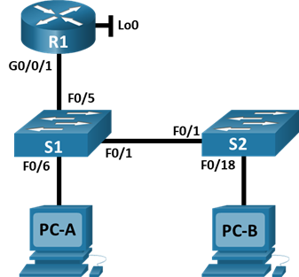

## Таблица адресации

| Устройство  | interface/vlan   | IP-адрес | Маска подсети |
| ----------- |:-----------:| -----:|:-----------:| 
|  R1 |	G0/0/1 | 192.168.10.1 | 255.255.255.0 | 
|  |	Loopback 0 | 10.10.1.1 | 255.255.255.0 |
|S1 |	VLAN 10 | 192.168.10.201 | 255.255.255.0 |
|  S2 |	VLAN 10 | 192.168.10.202 | 255.255.255.0 | 
|PC A | NIC | DHCP | 255.255.255.0 |
|PC B |	NIC | DHCP | 255.255.255.0 |


# Часть 1. Настройка основного сетевого устройства
## Шаг 1. Создайте сеть.
a.	Создайте сеть согласно топологии.

b.	Инициализация устройств

## Шаг 2. Настройте маршрутизатор R1.
a.	Загрузите следующий конфигурационный скрипт на R1.

Откройте окно конфигурации
```
enable
configure terminal
hostname R1
no ip domain lookup
ip dhcp excluded-address 192.168.10.1 192.168.10.9
ip dhcp excluded-address 192.168.10.201 192.168.10.202
!
ip dhcp pool Students
 network 192.168.10.0 255.255.255.0
 default-router 192.168.10.1
 domain-name CCNA2.Lab-11.6.1
!
interface Loopback0
 ip address 10.10.1.1 255.255.255.0
!
interface GigabitEthernet0/0/1
 description Link to S1
 ip dhcp relay information trusted
 ip address 192.168.10.1 255.255.255.0
 no shutdown
!
line con 0
 logging synchronous
 exec-timeout 0 0
```

b.	Проверьте текущую конфигурацию на R1, используя следующую команду:
```
R1# show ip interface brief
```
c.	Убедитесь, что IP-адресация и интерфейсы находятся в состоянии up / up (при необходимости устраните неполадки).
 
Закройте окно настройки.
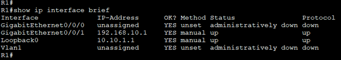
## Шаг 3. Настройка и проверка основных параметров коммутатора
a.	Настройте имя хоста для коммутаторов S1 и S2.

Откройте окно конфигурации

b.	Запретите нежелательный поиск в DNS.

c.	Настройте описания интерфейса для портов, которые используются в S1 и S2.

d.	Установите для шлюза по умолчанию для VLAN управления значение 192.168.10.1 на обоих коммутаторах.

S1
```
En
conf t
host S1
no ip domain-lookup
int f0/1
description Link to S2
int f0/5
description Link to R1
int f0/6
description Link to PC-A
exit
ip default-gateway 192.168.10.1
```

S2
```
En
conf t
host S1
no ip domain-lookup
int f0/1
description Link to S1
int f0/18
description Link to PC-B
exit
ip default-gateway 192.168.10.1
```

Часть 2. Настройка сетей VLAN на коммутаторах.

## Шаг 1. Сконфигруриуйте VLAN 10.

Добавьте VLAN 10 на S1 и S2 и назовите VLAN - Management.
```
conf t
vlan 10
name Management
exit
interface vlan 10
ip address 192.168.10.201 255.255.255.0
description Management SVI
no shut
exit
vlan 333
name Native
vlan 999
name ParkingLot
```
## Шаг 2. Сконфигруриуйте SVI для VLAN 10.
Настройте IP-адрес в соответствии с таблицей адресации для SVI для VLAN 10 на S1 и S2. Включите интерфейсы SVI и предоставьте описание для интерфейса.

## Шаг 3. Настройте VLAN 333 с именем Native на S1 и S2.
## Шаг 4. Настройте VLAN 999 с именем ParkingLot на S1 и S2.
# Часть 3. Настройки безопасности коммутатора.
```
conf t
int f0/1
sw m trunk
sw trunk native vlan 333 
end
```
## Шаг 1. Релизация магистральных соединений 802.1Q.
a.	Настройте все магистральные порты Fa0/1 на обоих коммутаторах для использования VLAN 333 в качестве native VLAN.

b.	Убедитесь, что режим транкинга успешно настроен на всех коммутаторах.
```
S1# show interface trunk
 ```
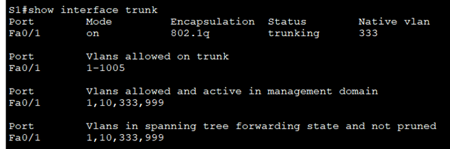

c.	Отключить согласование DTP F0/1 на S1 и S2. 
```
conf t
int f0/1
sw nonegot
```
d.	Проверьте с помощью команды show interfaces.
```
S1# show interfaces f0/1 switchport | include Negotiation
Negotiation of Trunking: Off

S1# show interfaces f0/1 switchport | include Negotiation
Negotiation of Trunking: Off
```
## Шаг 2. Настройка портов доступа
a.	На S1 настройте F0/5 и F0/6 в качестве портов доступа и свяжите их с VLAN 10.
```
conf t
int range f0/5-6
sw mode access
sw access vlan 10
```
b.	На S2 настройте порт доступа Fa0/18 и свяжите его с VLAN 10.
```
conf t
int range f0/18
sw mode access
sw access vlan 10
```
## Шаг 3. Безопасность неиспользуемых портов коммутатора
a.	На S1 и S2 переместите неиспользуемые порты из VLAN 1 в VLAN 999 и отключите неиспользуемые порты.

S1 
```
conf t
int range f0/2-4 , f0/7-24, g0/1-2
sw mode access
sw access vlan 999
shut
```
S2
```
conf t
int range f0/2-17 , f0/19-24, g0/1-2
sw mode access
sw access vlan 999
shut
```
b.	Убедитесь, что неиспользуемые порты отключены и связаны с VLAN 999, введя команду  show.

``` 
S1# show interfaces status
 ```
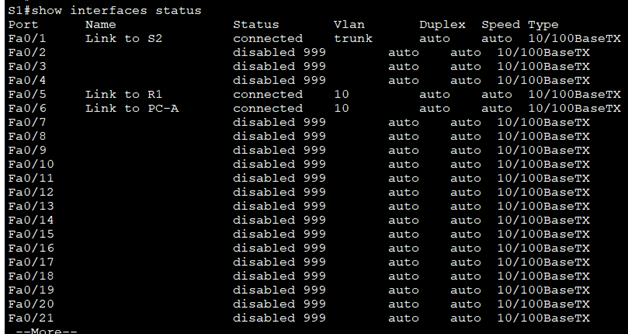
``` 
S2# show interfaces status
 ```
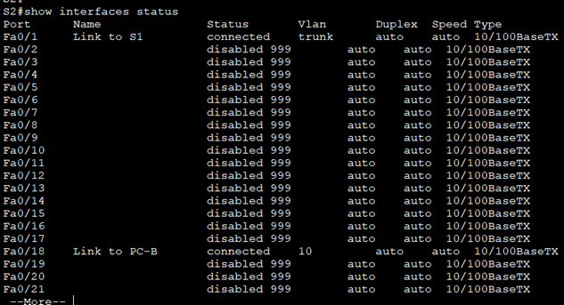
## Шаг 4. Документирование и реализация функций безопасности порта.
Интерфейсы F0/6 на S1 и F0/18 на S2 настроены как порты доступа. На этом шаге вы также настроите безопасность портов на этих двух портах доступа.

a.	На S1, введите команду show port-security interface f0/6  для отображения настроек по умолчанию безопасности порта для интерфейса F0/6. Запишите свои ответы ниже.

Конфигурация безопасности порта по умолчанию

| Функция  | Настройка по умолчанию   | 
| ----------- |:-----------:| 
| Защита портов	 | Disabled | 
| Максимальное количество записей MAC-адресов	 |	1 | 
| Режим проверки на нарушение безопасности |	Shutdown |
| Aging Time |	0 mins | 
| Aging Type |	Absolute | 
| Secure Static Address Aging	| Disabled | 
| Sticky MAC Address |	0 | 


b.	На S1 включите защиту порта на F0 / 6 со следующими настройками:

o	Максимальное количество записей MAC-адресов: 3

o	Режим безопасности: restrict

o	Aging time: 60 мин.

o	Aging type: неактивный
 ```
Conf t
int f0/6
sw port-security
sw port-security maximum 3
sw port-security violation restrict
sw port-security aging time 60
 ```
  ```
S1# show port-security interface f0/6
  ```
  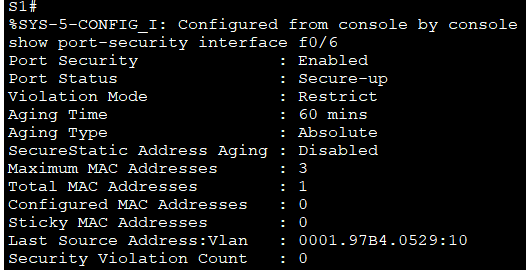
 ```
S1# show port-security address
  ```
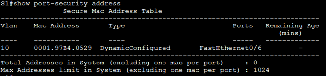
    
c.	Включите безопасность порта для F0 / 18 на S2. Настройте каждый активный порт доступа таким образом, чтобы он автоматически добавлял адреса МАС, изученные на этом порту, в текущую конфигурацию.

d.	Настройте следующие параметры безопасности порта на S2 F / 18:

o	Максимальное количество записей MAC-адресов: 2

o	Тип безопасности: Protect

o	Aging time: 60 мин.
 ```
Conf t
int f0/6
sw port-security
sw port-security mac-address sticky
sw port-security max 2
sw port-security violation protect
sw port-security aging time 60
 ```
e.	Проверка функции безопасности портов на S2 F0/18.
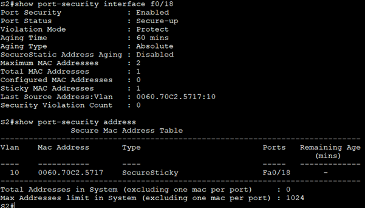
 
## Шаг 5. Реализовать безопасность DHCP snooping.
a.	На S2 включите DHCP snooping и настройте DHCP snooping во VLAN 10.

b.	Настройте магистральные порты на S2 как доверенные порты.

c.	Ограничьте ненадежный порт Fa0/18 на S2 пятью DHCP-пакетами в секунду.

d.	Проверка DHCP Snooping на S2.
 ```
Conf t
ip dhcp snooping
ip dhcp snooping vlan 10
no ip dhcp snooping information option
int f0/1
ip dhcp snooping trust
interface f0/18
ip dhcp snooping limit rate 5
 ```
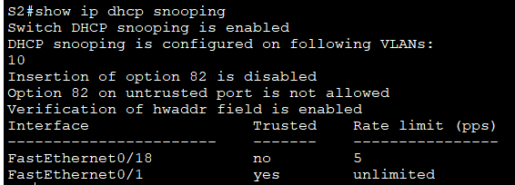

e.	В командной строке на PC-B освободите, а затем обновите IP-адрес.
 ```
C:\Users\Student> ipconfig /release
C:\Users\Student> ipconfig /renew
 ```
f.	Проверьте привязку отслеживания DHCP с помощью команды show ip dhcp snooping binding.
 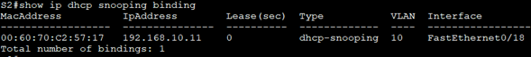
## Шаг 6. Реализация PortFast и BPDU Guard
a.	Настройте PortFast на всех портах доступа, которые используются на обоих коммутаторах.

b.	Включите защиту BPDU на портах доступа VLAN 10 S1 и S2, подключенных к PC-A и PC-B.

c.	Убедитесь, что защита BPDU и PortFast включены на соответствующих портах.
 ```
Conf t
interface f0/18
spanning-tree portfast
spanning-tree bpduguard enable
  ```
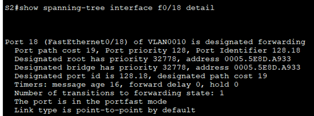
## Шаг 7. Проверьте наличие сквозного подключения.
Проверьте PING свзяь между всеми устройствами в таблице IP-адресации. В случае сбоя проверки связи может потребоваться отключить брандмауэр на хостах.


Вопросы для повторения

1.	С точки зрения безопасности порта на S2, почему нет значения таймера для оставшегося возраста в минутах, когда было сконфигурировано динамическое обучение - sticky?

Потому что коммутатор запомнит мак, с которого было подключение

2.	Что касается безопасности порта на S2, если вы загружаете скрипт текущей конфигурации на S2, почему порту 18 на PC-B никогда не получит IP-адрес через DHCP?

Потому что на порту стоит ограничение в 2 мака, порт не пропустит сообщения от устройств с другими маками

3.	Что касается безопасности порта, в чем разница между типом абсолютного устаревания и типом устаревание по неактивности?

Устаревание по неактивности – в случае отсутствия активности, абсолютное устаревание – в случае истечения лизы
