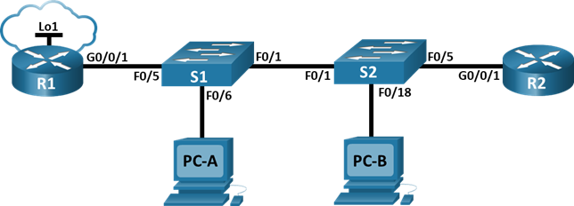
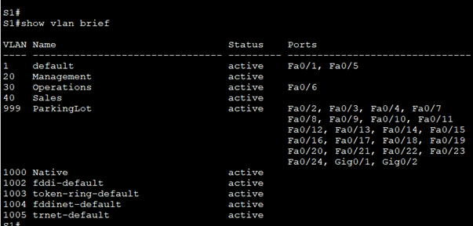
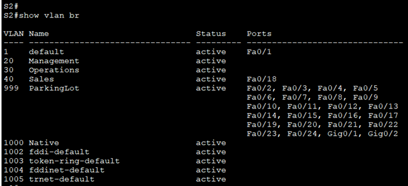
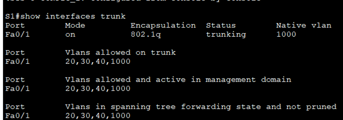
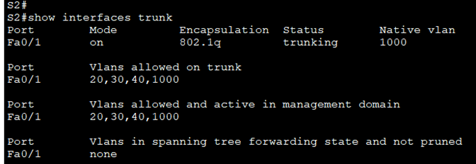
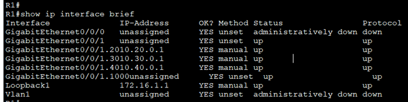

# Настройка и проверка расширенных списков контроля доступа.
## Топология



Таблица адресации

| Устройство  | Интерфейс   | IP-адрес | Маска подсети | Шлюз по умолчанию |
| ----------- |:-----------:| -----:|:-----------:| -----:|
| R1 |	G0/0/1 |	- |	- | - |
|  | G0/0/1.20 |	10.20.0.1 |	255.255.255.0 | -|
|  | G0/0/1.30 |	10.30.0.1 |	255.255.255.0 | -|
|  | G0/0/1.40	 |	10.40.0.1 | 255.255.255.0 | -|
|  | G0/0/1.1000 |	- | - | - |
|  | Loopback1 |	172.16.1.1 | 255.255.255.0 | - |
| R2 |	G0/0/1 |	10.20.0.4 |	255.255.255.0 | - |
|  S1 |	VLAN 20 |	10.20.0.2 |	255.255.255.0 | 10.20.0.1 |
|  S2 |	VLAN 20 |	10.20.0.3|	255.255.255.0 | 10.20.0.1 |
PC-A |	NIC	| 10.30.0.10 | 255.255.255.0 |	10.30.0.1 |	
PC-B |	NIC |	10.40.0.10 |	255.255.255.0 | 10.40.0.1 |


## Таблица VLAN

| VLAN  | Имя   | Назначенный интерфейс|
| ----------- |:-----------:| -----:|
| 20 | Management | S2: F0/5 |
| 30 | Operations | S1: F0/6 |
| 40 | Sales | S2: F0/18  |
| 999 | Parking_Lot | S1: F0/2-4, F0/7-24, G0/1-2 
|  |  | S2: F0/2-4, F0/6-17, F0/19-24, G0/1-2 |
| 1000 | Собственная | - |


# Часть 1. Создание сети и настройка основных параметров устройства
## Шаг 1. Создайте сеть согласно топологии.
Подключите устройства, как показано в топологии, и подсоедините необходимые кабели.
## Шаг 2. Произведите базовую настройку маршрутизаторов.
```
Enable
conf t
hostname R1
no ip domain lookup
enable secret class
line con 0
password cisco
login
line vty 0 4
password cisco
login
service password-encryption
banner motd # Unauthorized access is strictly prohibited. #
exit
copy running-config startup-config
```
Закройте окно настройки.

## Шаг 3. Настройте базовые параметры каждого коммутатора.
Откройте окно конфигурации
```
Enable
conf t
hostname S1
no ip domain lookup
enable secret class
line con 0
password cisco
login
line vty 0 4
password cisco
login
service password-encryption
banner motd # Unauthorized access is strictly prohibited. #
exit
copy running-config startup-config
```

# Часть 2. Настройка сетей VLAN на коммутаторах.
## Шаг 1. Создайте сети VLAN на коммутаторах.

a.	Создайте необходимые VLAN и назовите их на каждом коммутаторе из приведенной выше таблицы.
```
vlan 20
name Management
vlan 30
name Operations
vlan 40
name Sales
vlan 999
name ParkingLot
vlan 1000
name Native
```
b.	Настройте интерфейс управления и шлюз по умолчанию на каждом коммутаторе, используя информацию об IP-адресе в таблице адресации. 
```
int vlan 20
ip address 10.20.0.2 255.255.255.0
no shut
exit
ip default-gateway 10.20.0.1
```

c.	Назначьте все неиспользуемые порты коммутатора VLAN Parking Lot, настройте их для статического режима доступа и административно деактивируйте их.
```
interface range f0/2 - 4, f0/7 - 24, g0/1 – 2
sw mode access
sw access vlan 999
shut
```

## Шаг 2. Назначьте сети VLAN соответствующим интерфейсам коммутатора.
a.	Назначьте используемые порты соответствующей VLAN (указанной в таблице VLAN выше) и настройте их для режима статического доступа.
```
int f0/6
sw mode access
sw access vlan 30
```
b.	Выполните команду show vlan brief, чтобы убедиться, что сети VLAN назначены правильным интерфейсам.
 
 
 
 


# Часть 3. ·Настройте транки (магистральные каналы).
## Шаг 1. Вручную настройте магистральный интерфейс F0/1.

a.	Измените режим порта коммутатора на интерфейсе F0/1, чтобы принудительно создать магистральную связь. Не забудьте сделать это на обоих коммутаторах.

b.	В рамках конфигурации транка установите для native vlan значение 1000 на обоих коммутаторах. При настройке двух интерфейсов для разных собственных VLAN сообщения об ошибках могут отображаться временно.

c.	В качестве другой части конфигурации транка укажите, что VLAN 10, 20, 30 и 1000 разрешены в транке.

d.	Выполните команду show interfaces trunk для проверки портов магистрали, собственной VLAN и разрешенных VLAN через магистраль.

```
conf t
int f0/1
sw mode trunk
sw trunk native vlan 1000
sw trunk allowed vlan 20,30,40,1000
```
## Шаг 2. Вручную настройте магистральный интерфейс F0/5 на коммутаторе S1.

a.	Настройте интерфейс S1 F0/5 с теми же параметрами транка, что и F0/1. Это транк до маршрутизатора.

b.	Сохраните текущую конфигурацию в файл загрузочной конфигурации.

c.	Используйте команду show interfaces trunk для проверки настроек транка.
```
int f0/5
sw mode trunk
sw trunk native vlan 1000
sw trunk allowed vlan 20,30,40,1000
end
copy running-config startup-config 
```




# Часть 4. Настройте маршрутизацию.
## Шаг 1. Настройка маршрутизации между сетями VLAN на R1.

a.	Активируйте интерфейс G0/0/1 на маршрутизаторе.

b.	Настройте подинтерфейсы для каждой VLAN, как указано в таблице IP-адресации. Все подинтерфейсы используют инкапсуляцию 802.1Q. Убедитесь, что подинтерфейс для собственной VLAN не имеет назначенного IP-адреса. Включите описание для каждого подинтерфейса.

c.	Настройте интерфейс Loopback 1 на R1 с адресацией из приведенной выше таблицы.

d.	С помощью команды show ip interface brief проверьте конфигурацию подынтерфейса.
```
conf t
int g0/0/1
no shut
int g0/0/1.20
description Management Network
en d 20
ip address 10.20.0.1 255.255.255.0
int g0/0/1.30
en d 30
description Operations Network
ip address 10.30.0.1 255.255.255.0
int g0/0/1.40
en d 40
description Sales Network
ip address 10.40.0.1 255.255.255.0
int g0/0/1.1000
en d 1000 native
description Native VLAN
int Loopback 1
ip address 172.16.1.1 255.255.255.0
```


## Шаг 2. Настройка интерфейса R2 g0/0/1 с использованием адреса из таблицы и маршрута по умолчанию с адресом следующего перехода 10.20.0.1
```
conf t
interface g0/0/1
ip address 10.20.0.4 255.255.255.0
no shutdown
exit
ip route 0.0.0.0 0.0.0.0 10.20.0.1
```

# Часть 5. Настройте удаленный доступ

## Шаг 1. Настройте все сетевые устройства для базовой поддержки SSH.

a.	Создайте локального пользователя с именем пользователя SSHadmin и зашифрованным паролем $cisco123!

b.	Используйте ccna-lab.com в качестве доменного имени.

c.	Генерируйте криптоключи с помощью 1024 битного модуля.

d.	Настройте первые пять линий VTY на каждом устройстве, чтобы поддерживать только SSH-соединения и с локальной аутентификацией.
```
conf t
username SSHadmin secret $cisco123!
ip domain name ccna-lab.com
crypto key generate rsa general-keys modulus 1024
line vty 0 4
transport input ssh
login local
```
## Шаг 2. Включите защищенные веб-службы с проверкой подлинности на R1.

a.	Включите сервер HTTPS на R1.

R1(config)# ip http secure-server 

b.	Настройте R1 для проверки подлинности пользователей, пытающихся подключиться к веб-серверу.

R1(config)# ip http authentication local


# Часть 6. Проверка подключения
## Шаг 1. Настройте узлы ПК.

## Шаг 2. Выполните следующие тесты. Эхозапрос должен пройти успешно.


|От | Протокол | Назначение |
|:--|:--|:---|
|PC-A	| Ping |	10.40.0.10 |
|PC-A |	Ping |	10.20.0.1 |
|PC-B |	Ping |	10.30.0.10 |
|PC-B |	Ping |	10.20.0.1 |
|PC-B |	Ping |	172.16.1.1 |
|PC-B |	HTTPS |	10.20.0.1 |
|PC-B |	HTTPS |	172.16.1.1 |
|PC-B |	SSH |	10.20.0.1 |
|PC-B |	SSH |	172.16.1.1 |

# Часть 7. Настройка и проверка списков контроля доступа (ACL)
При проверке базового подключения компания требует реализации следующих политик безопасности:

Политика1. Сеть Sales не может использовать SSH в сети Management (но в  другие сети SSH разрешен). 

Политика 2. Сеть Sales не имеет доступа к IP-адресам в сети Management с помощью любого веб-протокола (HTTP/HTTPS). Сеть Sales также не имеет доступа к интерфейсам R1 с помощью любого веб-протокола. Разрешён весь другой веб-трафик (обратите внимание — Сеть Sales  может получить доступ к интерфейсу Loopback 1 на R1).

Политика 3. Сеть Sales не может отправлять эхо-запросы ICMP в сети Operations или Management. Разрешены эхо-запросы ICMP к другим адресатам. 

Политика 4: Cеть Operations  не может отправлять ICMP эхозапросы в сеть Sales. Разрешены эхо-запросы ICMP к другим адресатам. 

Шаг 1. Проанализируйте требования к сети и политике безопасности для планирования реализации ACL.
 
## Шаг 2. Разработка и применение расширенных списков доступа, которые будут соответствовать требованиям политики безопасности.
```
conf t
access-list 101 remark ACL 101 policy1-3
access-list 101 deny tcp 10.40.0.0 0.0.0.255 10.20.0.0 0.0.0.255 eq 22
access-list 101 deny tcp 10.40.0.0 0.0.0.255 10.20.0.0 0.0.0.255 eq 80
access-list 101 deny tcp 10.40.0.0 0.0.0.255 10.30.0.1 0.0.0.0 eq 80
access-list 101 deny tcp 10.40.0.0 0.0.0.255 10.40.0.1 0.0.0.0 eq 80
access-list 101 deny tcp 10.40.0.0 0.0.0.255 10.20.0.0 0.0.0.255 eq 443
access-list 101 deny tcp 10.40.0.0 0.0.0.255 10.30.0.1 0.0.0.0 eq 443
access-list 101 deny tcp 10.40.0.0 0.0.0.255 10.40.0.1 0.0.0.0 eq 443
access-list 101 deny icmp 10.40.0.0 0.0.0.255 10.20.0.0 0.0.0.255 echo
access-list 101 deny icmp 10.40.0.0 0.0.0.255 10.30.0.0 0.0.0.255 echo
access-list 101 permit ip any any
int g0/0/1.40
ip access-group 101 in

access-list 102 remark ACL 102 policy4
access-list 102 deny icmp 10.30.0.0 0.0.0.255 10.40.0.0 0.0.0.255 echo
access-list 102 permit ip any any
int g0/0/1.30
ip access-group 102 in
```

## Шаг 3. Убедитесь, что политики безопасности применяются развернутыми списками доступа.
Выполните следующие тесты. Ожидаемые результаты показаны в таблице:

|От | Протокол | Назначение | Результат |
|:--|:--|:---| :---|
|PC-A |	Ping | 10.40.0.10 |	Сбой |
|PC-A |	Ping |	10.20.0.1 |	Успех |
|PC-B |	Ping |	10.30.0.10 |	Сбой |
|PC-B |	Ping |	10.20.0.1 | Сбой |
|PC-B |	Ping |	172.16.1.1 |	Успех |
|PC-B |	HTTPS |	10.20.0.1 |	Сбой |
|PC-B |	HTTPS |	172.16.1.1 |	Успех |
|PC-B |	SSH |	10.20.0.4 |	Сбой |
|PC-B |	SSH |	172.16.1.1 |	Успех |

