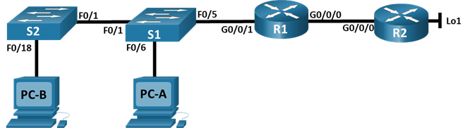

Настройка NAT для IPv4

Топология
 


| Устройство  | Интерфейс   | IP-адрес | Маска подсети | 
| ----------- |:-----------:| -----:|:-----------:| 
| R1 |	G0/0/0 |	209.165.200.230 |	255.255.255.248 |
|  | G0/0/1 |	192.168.1.1|	255.255.255.0 | 
| R2  | G0/0/0 |	209.165.200.225 |	255.255.255.248 | 
|  | Lo1	 |	209.165.200.1 | 255.255.255.224 | 
|  S1 |	VLAN 1 |	192.168.1.11 |	255.255.255.0 | 
|  S2 |	VLAN 1 |	192.168.1.12 |	255.255.255.0 | 
PC-A |	NIC	| 192.168.1.2| 255.255.255.0 |	
PC-B |	NIC |	192.168.1.3 |	255.255.255.0 | 

# Часть 1. Создание сети и настройка основных параметров устройства
В первой части лабораторной работы вам предстоит создать топологию сети и настроить базовые параметры для узлов ПК и коммутаторов.
## Шаг 1. Подключите кабели сети согласно приведенной топологии.
Подключите устройства в соответствии с топологией и подсоедините соответствующие кабели.
## Шаг 2. Произведите базовую настройку маршрутизаторов.
```
Enable
conf t
hostname R1
no ip domain lookup
enable secret class
line con 0
password cisco
login
line vty 0 4
password cisco
login
service password-encryption
banner motd # Unauthorized access is strictly prohibited. #
interface g0/0/0
ip address 209.165.200.230 255.255.255.248
no shut
int g0/0/1
ip address 192.168.1.1 255.255.255.0
no shut
ip route 0.0.0.0 0.0.0.0 209.165.200.225
end
copy running-config startup-config

Enable
conf t
hostname R2
no ip domain lookup
enable secret class
line con 0
password cisco
login
line vty 0 4
password cisco
login
service password-encryption
banner motd # Unauthorized access is strictly prohibited. #
interface g0/0/0
ip address 209.165.200.225 255.255.255.248
no shut
int loopback 1
ip address 209.165.200.1 255.255.255.224
no shut
end
copy running-config startup-config
```

## Шаг 3. Настройте базовые параметры каждого коммутатора.
```
Enable
conf t
hostname S1
no ip domain lookup
enable secret class
line con 0
password cisco
login
line vty 0 4
password cisco
login
service password-encryption
banner motd # Unauthorized access is strictly prohibited. #
int range f0/2-4, f0/7-24, g0/1-2
shut
exit
int vlan 1
ip address 192.168.1.11 255.255.255.0
no shut
exit
ip default-gateway 192.168.1.1
end
copy running-config startup-config

Enable
conf t
hostname S2
no ip domain lookup
enable secret class
line con 0
password cisco
login
line vty 0 4
password cisco
login
service password-encryption
banner motd # Unauthorized access is strictly prohibited. #
int range f0/2-17, f0/19-24, g0/1-2
shut
exit
int vlan 1
ip address 192.168.1.12 255.255.255.0
no shut
exit
ip default-gateway 192.168.1.1
end
copy running-config startup-config
```

# Часть 2. Настройка и проверка NAT для IPv4.
В части 2 необходимо настроить и проверить NAT для IPv4.
## Шаг 1. Настройте NAT на R1, используя пул из трех адресов 209.165.200.226-209.165.200.228. 

a.	Настройте простой список доступа, который определяет, какие хосты будут разрешены для трансляции. В этом случае все устройства в локальной сети R1 имеют право на трансляцию.
```
R1(config)# access-list 1 permit 192.168.1.0 0.0.0.255 
```
b.	Создайте пул NAT и укажите ему имя и диапазон используемых адресов.
```
R1(config)# ip nat pool PUBLIC_ACCESS 209.165.200.226 209.165.200.228 
netmask 255.255.255.248 
```

c.	Настройте перевод, связывая ACL и пул с процессом преобразования.
```
R1(config)# ip nat inside source list 1 pool PUBLIC_ACCESS 
```

d.	Задайте внутренний (inside) интерфейс. 
```
R1(config)# interface g0/0/1
R1(config-if)# ip nat inside
```
e.	Определите внешний (outside) интерфейс.
```
R1(config)# interface g0/0/0
R1(config-if)# ip nat outside
```
## Шаг 2. Проверьте и проверьте конфигурацию. 
a.	С PC-B,  запустите эхо-запрос интерфейса Lo1 (209.165.200.1) на R2. Если эхо-запрос не прошел, выполните процес поиска и устранения неполадок. На R1 отобразите таблицу NAT на R1 с помощью команды show ip nat translations.
```
R1# show ip nat translations
Pro Inside global Inside local Outside local Outside global
--- 209.165.200.226 192.168.1.3 --- --- 
226:1 192.168.1. 3:1 209.165.200. 1:1 209.165.200. 1:1 
Total number of translations: 2
```
Вопросы:

Во что был транслирован внутренний локальный адрес PC-B?
209.165.200.226

Какой тип адреса NAT является переведенным адресом?

Global

b.	С PC-A, запустите  эхо-запрос интерфейса Lo1 (209.165.200.1) на R2. Если эхо-запрос не прошел, выполните отладку. На R1 отобразите таблицу NAT на R1 с помощью команды show ip nat translations.
```
R1# show ip nat translations 
Pro Inside global Inside local Outside local Outside global
--- 209.165.200.227 192.168.1.2 --- ---
--- 209.165.200.226 192.168.1.3 --- ---
227:1 192.168.1. 2:1 209.165.200. 1:1 209.165.200. 1:1
226:1 192.168.1. 3:1 209.165.200. 1:1 209.165.200. 1:1
Total number of translations: 4
```
c.	Обратите внимание, что предыдущая трансляция для PC-B все еще находится в таблице. Из S1, эхо-запрос интерфейса Lo1 (209.165.200.1) на R2. Если эхо-запрос не прошел, выполните отладку. На R1 отобразите таблицу NAT на R1 с помощью команды show ip nat translations.
```
R1# show ip nat translations
Pro Inside global Inside local Outside local Outside global
--- 209.165.200.227 192.168.1.2 --- ---
--- 209.165.200.226 192.168.1.3 --- ---
--- 209.165.200.228 192.168.1.11 --- ---
226:1 192.168.1. 3:1 209.165.200. 1:1 209.165.200. 1:1
228:0 192.168.1. 11:0 209.165.200. 1:0 209.165.200. 1:0 209.165.200. 1:0
Total number of translations: 5
```
d.	Теперь запускаем пинг R2 Lo1 из S2. На этот раз перевод завершается неудачей, и вы получаете эти сообщения (или аналогичные) на консоли R1:

```
Sep 23 15:43:55.562: %IOSXE-6-PLATFORM: R0/0: cpp_cp: QFP:0.0 Thread:000 
TS:00000001473688385900 %NAT-6-ADDR_ALLOC_FAILURE: Address allocation failed;
pool 1 may be exhausted
```

e.	Это ожидаемый результат, потому что выделено только 3 адреса, и мы попытались ping Lo1 с четырех устройств. Напомним, что NAT — это трансляция «один-в-один». Как много выделено трансляций? Введите команду show ip nat translations verbose , и вы увидите, что ответ будет 24 часа.
```
R1# show ip nat translations verbose 
Pro Inside global Inside local Outside local Outside global
--- 209.165.200.226 192.168.1.3 --- ---
  create: 09/23/19 15:35:27, use: 09/23/19 15:35:27, timeout: 23:56:42
  Map-Id(In): 1
<output omitted>
```
f.	Учитывая, что пул ограничен тремя адресами, NAT для пула адресов недостаточно для нашего приложения. Очистите преобразование NAT и статистику, и мы перейдем к PAT.
```
R1# clear ip nat translations * 
R1# clear ip nat statistics 
```

# Часть 3. Настройка и проверка PAT для IPv4.
В части 3 необходимо настроить замену NAT на PAT в пул адресов, а затем на PAT с помощью интерфейса.

## Шаг 1. Удалите команду преобразования на R1.

Компоненты конфигурации преобразования адресов в основном одинаковы; что-то (список доступа) для идентификации адресов, пригодных для перевода, дополнительно настроенный пул адресов для их преобразования и команды, необходимые для идентификации внутреннего и внешнего интерфейсов. Из части 1 наш список доступа (список доступа 1) по-прежнему корректен для сетевого сценария, поэтому нет необходимости воссоздавать его. Мы будем использовать один и тот же пул адресов, поэтому нет необходимости воссоздавать эту конфигурацию. Кроме того, внутренний и внешний интерфейсы не меняются. Чтобы начать работу в части 3, удалите команду, связывающую ACL и пул вместе.
```
R1(config)# no ip nat inside source list 1 pool PUBLIC_ACCESS 
```
## Шаг 2. Добавьте команду PAT на R1.
Теперь настройте преобразование PAT в пул адресов (помните, что ACL и Pool уже настроены, так что это единственная команда, которую нам нужно изменить с NAT на PAT).
```
R1(config)# ip nat inside source list 1 pool PUBLIC_ACCESS overload 
```
## Шаг 3. Протестируйте и проверьте конфигурацию.
a.	Давайте проверим, что PAT работает. С PC-B,  запустите эхо-запрос интерфейса Lo1 (209.165.200.1) на R2. Если эхо-запрос не прошел, выполните отладку. На R1 отобразите таблицу NAT на R1 с помощью команды show ip nat translations.
```
R1# show ip nat translations
Pro Inside global Inside local Outside local Outside global
226:1 192.168.1. 3:1 209.165.200. 1:1 209.165.200. 1:1
Total number of translations: 1#
```
Вопросы:

Во что был транслирован внутренний локальный адрес PC-B?

 209.165.200.226

Какой тип адреса NAT является переведенным адресом?

 Global

Чем отличаются выходные данные команды show ip nat translations из упражнения NAT?

номер трансляции
 
b.	С PC-A, запустите эхо-запрос интерфейса Lo1 (209.165.200.1) на R2. Если эхо-запрос не прошел, выполните отладку. На R1 отобразите таблицу NAT на R1 с помощью команды show ip nat translations.
```
R1# show ip nat translations
Pro Inside global Inside local Outside local Outside global
226:1 192.168.1. 2:1 209.165.200. 1:1 209.165.200. 1:1
Total number of translations: 1

R1# show ip nat translations verbose 
Pro Inside global Inside local Outside local Outside global
icmp 209.165.200.226:1 192.168.1.2:1 209.165.200.1:1 209.165.200.1:1 
  create: 09/23/19 16:57:22, use: 09/23/19 16:57:25, timeout: 00:01:00
<output omitted>
```

c.	Генерирует трафик с нескольких устройств для наблюдения PAT. На PC-A и PC-B используйте параметр -t с командой ping, чтобы отправить безостановочный ping на интерфейс Lo1 R2 (ping -t 209.165.200.1), затем вернитесь к R1 и выполните команду show ip nat translations:
```
R1# show ip nat translations
Pro Inside global Inside local Outside local Outside global
icmp 209.165.200.226:1 192.168.1.2:1 209.165.200.1:1 209.165.200.1:1 
226:2 192.168.1. 3:1 209.165.200. 1:1 209.165.200. 1:2 
Total number of translations: 2 
```
Обратите внимание, что внутренний глобальный адрес одинаков для обоих сеансов. 

Вопрос:

Как маршрутизатор отслеживает, куда идут ответы? 

 По номерам портов

d.	PAT в пул является очень эффективным решением для малых и средних организаций. Тем не менее есть неиспользуемые адреса IPv4, задействованные в этом сценарии. Мы перейдем к PAT с перегрузкой интерфейса, чтобы устранить эту трату IPv4 адресов. Остановите ping на PC-A и PC-B с помощью комбинации клавиш Control-C, затем очистите трансляции и статистику:
```
R1# clear ip nat translations * 
R1# clear ip nat statistics 
```
## Шаг 4. На R1 удалите команды преобразования nat pool.
Опять же, наш список доступа (список доступа 1) по-прежнему корректен для сетевого сценария, поэтому нет необходимости воссоздавать его. Кроме того, внутренний и внешний интерфейсы не меняются. Чтобы начать работу с PAT к интерфейсу, очистите конфигурацию, удалив пул NAT и команду, связывающую ACL и пул вместе.
```
R1(config)# no ip nat inside source list 1 pool PUBLIC_ACCESS overload 
R1(config)# no ip nat pool PUBLIC_ACCESS
```
## Шаг 5. Добавьте команду PAT overload, указав внешний интерфейс.
Добавьте команду PAT, которая вызовет перегрузку внешнего интерфейса.
```
R1(config)# ip nat inside source list 1 interface g0/0/0 overload 
```
## Шаг 6. Протестируйте и проверьте конфигурацию. 
a.	Давайте проверим PAT, чтобы интерфейс работал. С PC-B,  запустите эхо-запрос интерфейса Lo1 (209.165.200.1) на R2. Если эхо-запрос не прошел, выполните отладку. На R1 отобразите таблицу NAT на R1 с помощью команды show ip nat translations.
```
R1# show ip nat translations
Pro Inside global Inside local Outside local Outside global
209.165.200. 230:1 192.168.1. 3:1 209.165.200. 1:1 209.165.200. 1:1 
Total number of translations: 1 
```
b.	Сделайте трафик с нескольких устройств для наблюдения PAT. На PC-A и PC-B используйте параметр -t с командой ping для отправки безостановочного ping на интерфейс Lo1 R2 (ping -t 209.165.200.1). На S1 и S2 выполните привилегированную команду exec ping 209.165.200.1 повторить 2000. Затем вернитесь к R1 и выполните команду show ip nat translations.
```
R1# show ip nat translations
Pro Inside global Inside local Outside local Outside global
209.165.200. 230:3 192.168.1. 11:1 209.165.200. 1:1 209.165.200. 1:3 
209.165.200. 230:2 192.168.1. 2:1 209.165.200. 1:1 209.165.200. 1:2 
209.165.200. 230:4 192.168.1. 3:1 209.165.200. 1:1 209.165.200. 1:4 
209.165.200. 230:1 192.168.1. 12:1 209.165.200. 1:1 209.165.200. 1:1 
Total number of translations: 4 
```
Теперь все внутренние глобальные адреса сопоставляются с IP-адресом интерфейса g0/0/0.

Остановите все пинги. На PC-A и PC-B, используя комбинацию клавиш CTRL-C.


# Часть 4. Настройка и проверка статического NAT для IPv4.
В части 4 будет настроена статическая NAT таким образом, чтобы PC-A был доступен напрямую из Интернета. PC-A будет доступен из R2 по адресу 209.165.200.229.

## Шаг 1. На R1 очистите текущие трансляции и статистику.
```
R1# clear ip nat translations * 
R1# clear ip nat statistics 
```
## Шаг 2. На R1 настройте команду NAT, необходимую для статического сопоставления внутреннего адреса с внешним адресом.
Для этого шага настройте статическое сопоставление между 192.168.1.11 и 209.165.200.1 с помощью следующей команды:
```
R1(config)# ip nat inside source static 192.168.1.2 209.165.200.229
``` 
## Шаг 3. Протестируйте и проверьте конфигурацию.
a.	Давайте проверим, что статический NAT работает. На R1 отобразите таблицу NAT на R1 с помощью команды show ip nat translations, и вы увидите статическое сопоставление.
```
R1# show ip nat translations
Pro Inside global Inside local Outside local Outside global
--- 209.165.200.229 192.168.1.2 --- ---
Total number of translations: 1
```
b.	Таблица перевода показывает, что статическое преобразование действует. Проверьте это, запустив ping  с R2 на 209.165.200.229. Плинги должны работать.
Примечание. Возможно, вам придется отключить брандмауэр ПК для работы pings.

c.	На R1 отобразите таблицу NAT на R1 с помощью команды show ip nat translations, и вы увидите статическое сопоставление и преобразование на уровне порта для входящих pings.
```
R1# show ip nat translations
Pro Inside global Inside local Outside local Outside global
--- 209.165.200.229 192.168.1.2 --- ---
229:3 192.168.1. 2:3 209.165.200. 225:3 209.165.200. 225:3 209.165.200. 
Total number of translations: 2
```
Это подтверждает, что статический NAT работает.

