## Топология 
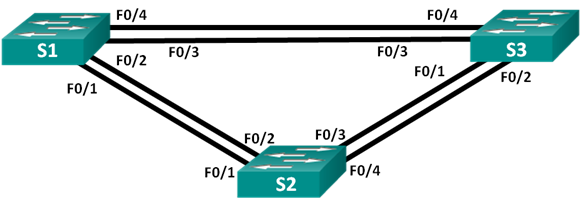

## Таблица адресации

| Устройство  | Интерфейс   | IP-адрес | Маска подсети |
| ----------- |:-----------:| -----:|:-----------:| 
|  S1 |	VLAN 1 | 192.168.1.1 | 255.255.255.0 | 
|  S2 |	VLAN 1 | 192.168.1.2 | 255.255.255.0 |
| S3 |	VLAN 1 | 192.168.1.3 | 255.255.255.0 |	

# Часть 1:	Создание сети и настройка основных параметров устройства
## Шаг 1:	Создайте сеть согласно топологии.
## Шаг 2:	Выполните инициализацию и перезагрузку коммутаторов.
## Шаг 3:	Настройте базовые параметры каждого коммутатора.
a.	Отключите поиск DNS.

b.	Присвойте имена устройствам в соответствии с топологией.

c.	Назначьте class в качестве зашифрованного пароля доступа к привилегированному режиму.

d.	Назначьте cisco в качестве паролей консоли и VTY и активируйте вход для консоли и VTY каналов.

e.	Настройте logging synchronous для консольного канала.

f.	Настройте баннерное сообщение дня (MOTD) для предупреждения пользователей о запрете несанкционированного доступа.

g.	Задайте IP-адрес, указанный в таблице адресации для VLAN 1 на всех коммутаторах.

Скопируйте текущую конфигурацию в файл загрузочной конфигурации.
```
Enable
conf t
hostname S1
no ip domain lookup
enable secret class
line con 0
password cisco
login
line vty 0 4
password cisco
login
logging synchronous
service password-encryption
banner motd # Unauthorized access is strictly prohibited. #


conf t
vlan 1
int vlan 1
ip address 192.168.1.1 255.255.255.0
no shut
copy running-config startup-config
exit
```
Шаг 4:	Проверьте связь.

Проверьте способность компьютеров обмениваться эхо-запросами.
Успешно ли выполняется эхо-запрос от коммутатора S1 на коммутатор S2?	Да
Успешно ли выполняется эхо-запрос от коммутатора S1 на коммутатор S3?	Да
Успешно ли выполняется эхо-запрос от коммутатора S2 на коммутатор S3?	Да
Выполняйте отладку до тех пор, пока ответы на все вопросы не будут положительными.
 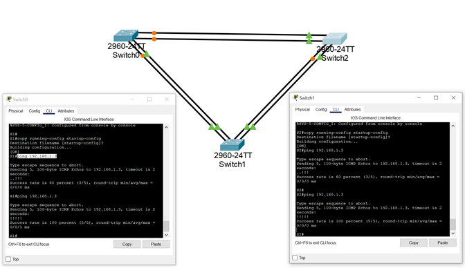

# Часть 2:	Определение корневого моста

Для каждого экземпляра протокола spanning-tree (коммутируемая сеть LAN или широковещательный домен) существует коммутатор, выделенный в качестве корневого моста. Корневой мост служит точкой привязки для всех расчётов протокола spanning-tree, позволяя определить избыточные пути, которые следует заблокировать.
Процесс выбора определяет, какой из коммутаторов станет корневым мостом. Коммутатор с наименьшим значением идентификатора моста (BID) становится корневым мостом. Идентификатор BID состоит из значения приоритета моста, расширенного идентификатора системы и MAC-адреса коммутатора. Значение приоритета может находиться в диапазоне от 0 до 65535 с шагом 4096. По умолчанию используется значение 32768.

## Шаг 1:	Отключите все порты на коммутаторах.
```
Conf t
interface range f0/1-24, g0/1-2
shut
exit
```
## Шаг 2:	Настройте подключенные порты в качестве транковых.
```
interface range f0/1-4
sw mode trunk
exit
```
## Шаг 3:	Включите порты F0/2 и F0/4 на всех коммутаторах.
```
interface range f0/2, f0/4
no shut
end
```
## Шаг 4:	Отобразите данные протокола spanning-tree.

Введите команду show spanning-tree на всех трех коммутаторах. Приоритет идентификатора моста рассчитывается путем сложения значений приоритета и расширенного идентификатора системы. Расширенным идентификатором системы всегда является номер сети VLAN. В примере ниже все три коммутатора имеют равные значения приоритета идентификатора моста (32769 = 32768 + 1, где приоритет по умолчанию = 32768, номер сети VLAN = 1); следовательно, коммутатор с самым низким значением MAC-адреса становится корневым мостом (в примере — S2).
 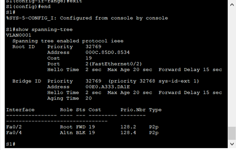

 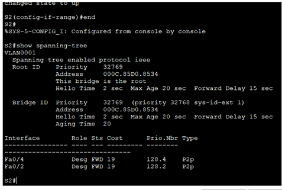
 
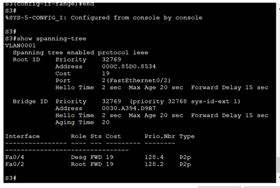
 

Примечание. Режим STP по умолчанию на коммутаторе 2960 — протокол STP для каждой сети VLAN (PVST).
В схему ниже запишите роль и состояние (Sts) активных портов на каждом коммутаторе в топологии.
 
 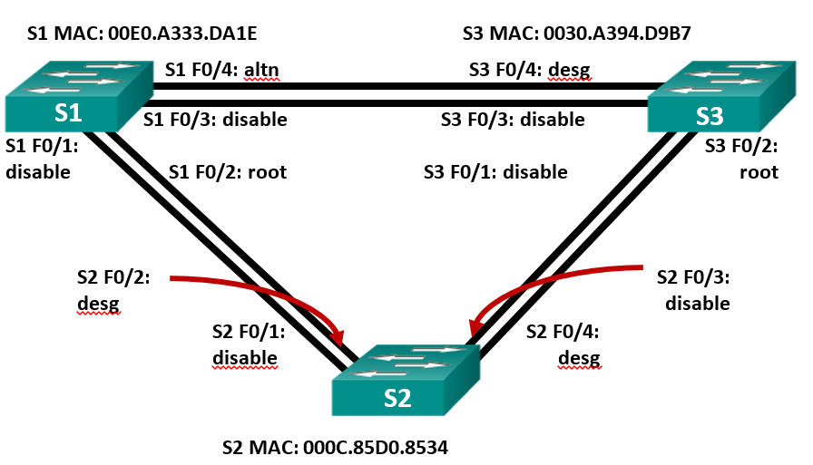

С учетом выходных данных, поступающих с коммутаторов, ответьте на следующие вопросы.
Какой коммутатор является корневым мостом? 

S2

Почему этот коммутатор был выбран протоколом spanning-tree в качестве корневого моста?

У него самое низкое значение mac-адреса 

Какие порты на коммутаторе являются корневыми портами? 

S1 F0/2 и S3 F0/2

Какие порты на коммутаторе являются назначенными портами 

S2 F0/4 и S2 F0/2 и S3 F0/4

Какой порт отображается в качестве альтернативного и в настоящее время заблокирован? 

S1 F0/4

Почему протокол spanning-tree выбрал этот порт в качестве невыделенного (заблокированного) порта?

Это бОльший номер порта у комутатора с самым высоким значением mac-адреса 
# Часть 3:	Наблюдение за процессом выбора протоколом STP порта, исходя из стоимости портов
Алгоритм протокола spanning-tree (STA) использует корневой мост как точку привязки, после чего определяет, какие порты будут заблокированы, исходя из стоимости пути. Порт с более низкой стоимостью пути является предпочтительным. Если стоимости портов равны, процесс сравнивает BID. Если BID равны, для определения корневого моста используются приоритеты портов. Наиболее низкие значения являются предпочтительными. В части 3 вам предстоит изменить стоимость порта, чтобы определить, какой порт будет заблокирован протоколом spanning-tree.

## Шаг 1:	Определите коммутатор с заблокированным портом.
При текущей конфигурации только один коммутатор может содержать заблокированный протоколом STP порт. Выполните команду show spanning-tree на обоих коммутаторах некорневого моста. В примере ниже протокол spanning-tree блокирует порт F0/4 на коммутаторе с самым высоким идентификатором BID (S1).

## Шаг 2:	Измените стоимость порта.
Помимо заблокированного порта, единственным активным портом на этом коммутаторе является порт, выделенный в качестве порта корневого моста. Уменьшите стоимость этого порта корневого моста до 18, выполнив команду spanning-tree vlan 1 cost 18 режима конфигурации интерфейса.
```
S1(config)# interface f0/2
S1(config-if)# spanning-tree vlan 1 cost 18
```
## Шаг 3:	Просмотрите изменения протокола spanning-tree.
Повторно выполните команду show spanning-tree на обоих коммутаторах некорневого моста. Обратите внимание, что ранее заблокированный порт (S1 – F0/4) теперь является назначенным портом, и протокол spanning-tree теперь блокирует порт на другом коммутаторе некорневого моста (S3 – F0/4).
 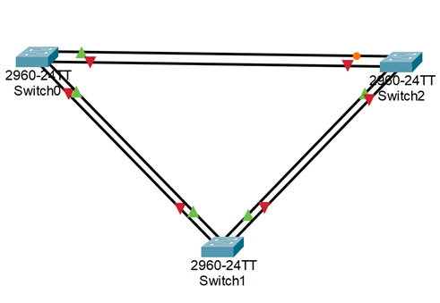
 
 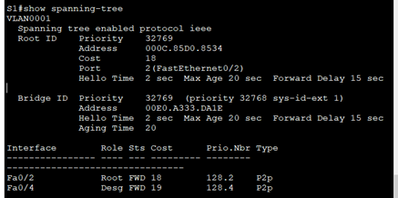

 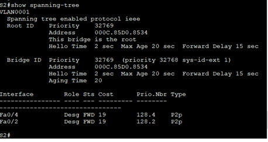

 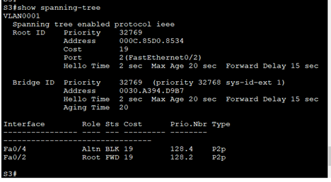

Почему протокол spanning-tree заменяет ранее заблокированный порт на назначенный порт и блокирует порт, который был назначенным портом на другом коммутаторе?

Потому что стоимость порта важнее значения мака

## Шаг 4:	Удалите изменения стоимости порта.

a.	Выполните команду no spanning-tree vlan 1 cost 18 режима конфигурации интерфейса, чтобы удалить запись стоимости, созданную ранее.
```
S1(config)# interface f0/2
S1(config-if)# no spanning-tree vlan 1 cost 18
```
b.	Повторно выполните команду show spanning-tree, чтобы подтвердить, что протокол STP сбросил порт на коммутаторе некорневого моста, вернув исходные настройки порта. Протоколу STP требуется примерно 30 секунд, чтобы завершить процесс перевода порта.

# Часть 4:	Наблюдение за процессом выбора протоколом STP порта, исходя из приоритета портов

Если стоимости портов равны, процесс сравнивает BID. Если BID равны, для определения корневого моста используются приоритеты портов. Значение приоритета по умолчанию — 128. STP объединяет приоритет порта с номером порта, чтобы разорвать связи. Наиболее низкие значения являются предпочтительными. В части 4 вам предстоит активировать избыточные пути до каждого из коммутаторов, чтобы просмотреть, каким образом протокол STP выбирает порт с учетом приоритета портов.

a.	Включите порты F0/1 и F0/3 на всех коммутаторах.
```
conf t
int range f0/1, f0/3
no shut
```
b.	Подождите 30 секунд, чтобы протокол STP завершил процесс перевода порта, после чего выполните команду show spanning-tree на коммутаторах некорневого моста. Обратите внимание, что порт корневого моста переместился на порт с меньшим номером, связанный с коммутатором 
 
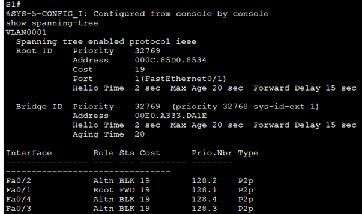

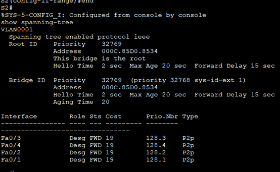

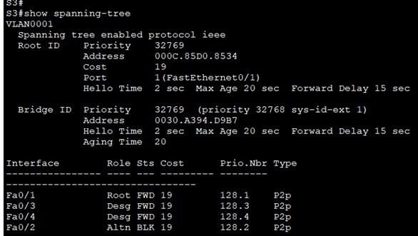


Какой порт выбран протоколом STP в качестве порта корневого моста на каждом коммутаторе некорневого моста?

 S1 Fa0/1 и S3 Fa0/1 

Почему протокол STP выбрал эти порты в качестве портов корневого моста на этих коммутаторах?

STP выбрал наименьшие порты коммутаторов, которые не являются корневым мостом

	Вопросы для повторения

1.	Какое значение протокол STP использует первым после выбора корневого моста, чтобы определить выбор порта?

Стоимость пути

2.	Если первое значение на двух портах одинаково, какое следующее значение будет использовать протокол STP при выборе порта?

Bridge id

3.	Если оба значения на двух портах равны, каким будет следующее значение, которое использует протокол STP при выборе порта?

Номер порта
